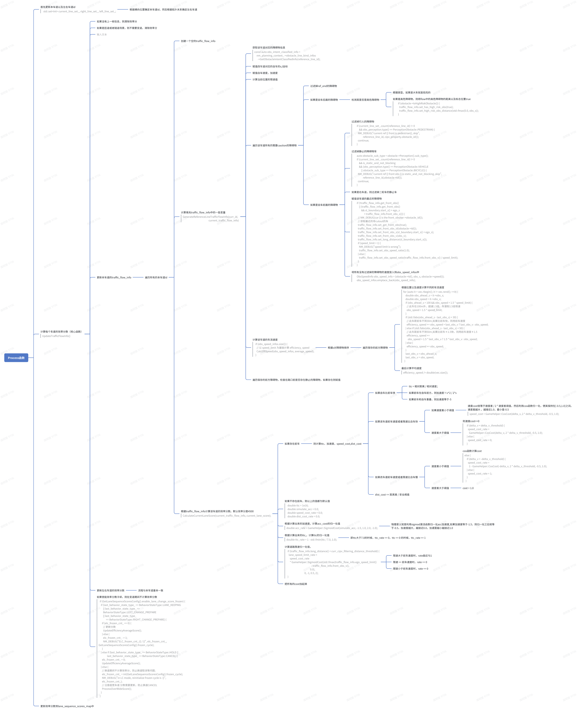
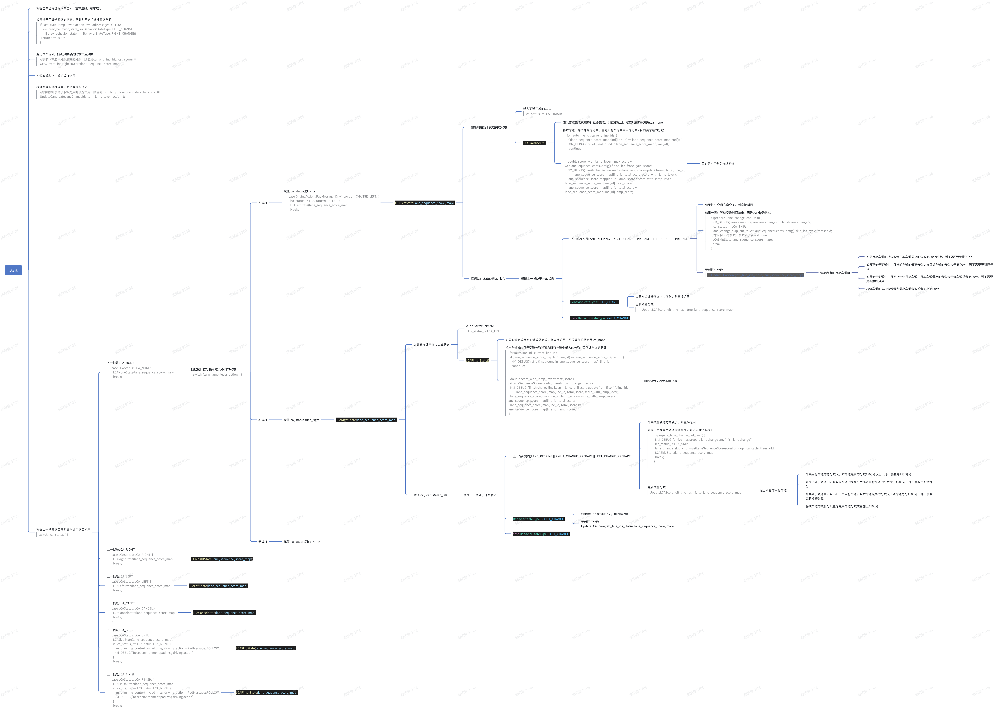

<center><span style="font-size:2rem;font-weight:bold;">新框架中的分数计算</span></center>

<div style="page-break-after: always;"></div>

[toc]

<div style="page-break-after: always;"></div>

## 模块介绍

这个模块顾名思义，作用是对道路模型给出的lane sequence做预处理，并对每一个lane打分,然后给到决策树搜索模块做具体决策：变道，保持等等。

分数主要分为以下几块(后续可以继续增加)：

| 分数类型         | 实现类                           |
| ---------------- | -------------------------------- |
| 车道静态导航分   | navigate_intention_decider.cc    |
| 车道动态效率分数 | lane_efficiency_decider.cc       |
| 静态障碍物遮挡分 | cone_scenario_decider.cc         |
| 目标车道分数     | lane_change_assistant_decider.cc |

## 分数设计

### 静态导航分:navigate_intention_deicder.cc

#### 综述

这个模块的作用是根据上游传下来的静态导航分数，将其赋值到lane_sequence_scores_map中，并根据车道类型以及静态分数给一个推荐的导航指令。

#### 具体设计：

##### 输入

`reference_lines_infos` `stati_score_map`

##### 处理 

  

- Process
  - 首先根据injector拿到上一帧的state信息获取上一帧的当前车道id last_curr_line_id_cache_ = last_current_line_id;
  - 根据上一帧的当前车道id，更新当前帧的本车道id
  - 根据上游环境模型传来的静态分数，给lane_sequence_score_map赋值
  - 计算本车道的主路分数   GenerateMainAuxiliaryScore(curr_ref_line_id, lane_sequence_score_map,                              update_line);
    - 获取合并到本车道的所有车道ids:merge_ref_lines   auto merge_ref_lines =     GetMergeRefLines(ref_line_info->reference_line()->GetMergeLines());
    - 如果本车道是主路类型且主路类型的分数小于阈值（即可信度较低）
    - 如果本车道是主路类型且主路类型的分数大于阈值（即可信度较高）
      - 遍历所有的合并车道
        - 过滤掉非主路的车道
        - 如果合并车道是主路，且可信度高，则将该车道的总静态分加上辅助分     lane_sequence_score_map.at(ref_line_info->GetId())     .static_score.set_total_static_score(     signal_score * GetLaneSequenceScoresConfig().auxiliary_score     + curr_lane_score);
        - 如果合并道路是主路，但是可信度不高，则将改车道的总静态分减去一个辅助分
        - 计算总分数：total_score和total_static_score
  - 根据分数计算推荐的导航动作 GenerateNaviStaticAction(curr_ref_line_id, lane_sequence_score_map);
    - 首先找到本车道
      - 找到本车道所有的左右车道
      - 找到左右车道中的最高静态分
      - 根据左右车道哪个静态分数最高，确定推荐的action

##### 输出

```
lane_sequence_score_map
```

### 车道动态效率分：lane_efficiency_decider.cc

#### 综述

这个模块的作用是根据每个车道绑定的障碍物以及计算的限速车流等信息，计算每个车道的效率分数，给到最终的分数计算中，让决策模块决定是否要触发效率变道。

#### 具体设计

##### 输入

每条车道的障碍物绑定信息：

obs_intent_classified_info->GetObstacleInfoByType(

​         ObstacleIntentClassifiedInfo::CAUTION

以及每条车道的限速信息

##### 处理



- Process函数
  - 首先更新本车道以及左右车道id   std::set<int> current_line_set_, right_line_set_, left_line_set_;
    - 根据横向位置确定本车道id，然后根据拓扑关系确定左右车道
  - 计算每个车道的效率分数（核心函数） UpdateTrafficFlowInfo()
    - 如果没有上一帧信息，则清除效率分
    - 如果是匝道或者隧道场景，则不需要变道，清除效率分
    - 
    - 更新本车道的traffic_flow_info
      - 遍历所有的本车道id
        - 创建一个空的traffic_flow_info
        - 计算填充traffic_flow_info中的一些变量 GenerateReferenceLineTrafficFlowInfo(curr_id,                                               current_traffic_flow_info)
          - 获取该车道对应的障碍物信息 const auto obs_intent_classified_info =     nm_planning_context_->obstacle_line_bind_infos       ->GetObstacleIntentClassifiedInfo(reference_line_id);
          - 赋值改车道对应的自车的s,l坐标
          - 赋值自车速度，加速度
          - 计算当前位置的限速值
          - 遍历该车道所有的需要caution的障碍物
            - 过滤掉ref_end的障碍物
            - 如果是自车后面的障碍物
              - 检测其是否是高危障碍物
                - 根据类型，如果是大车就是危险的
                - 如果是高危障碍物，则将flow中的高危障碍物的距离以及标志位置true       if (obstacle->IsHighRiskObstacle()) {         traffic_flow_info.set_has_high_risk_obs(true);         traffic_flow_info.set_high_risk_obs_distance(std::fmax(0.0, obs_s));       }
            - 如果是自车前面的障碍物
              - 过滤掉行人的障碍物       if (current_line_set_.count(reference_line_id) != 0           && obs_perception.type() == PerceptionObstacle::PEDESTRIAN) {         NM_DEBUG("current ref {} front is pedestrian{}, skip",                  reference_line_id, cipv_property.obstacle_id());         continue;       }
              - 过滤掉静止的障碍物车       auto obstacle_sub_type = obstacle->Perception().sub_type();       if (current_line_set_.count(reference_line_id) != 0           && is_static_and_not_blocking           && (obs_perception.type() == PerceptionObstacle::VEHICLE               || obstacle_sub_type == PerceptionObstacle::BICYCLE)) {         NM_DEBUG("current ref {} front obs {} is static_and_not_blocking ,skip",                  reference_line_id,obstacle->Id());         continue;       }
              - 如果是右车道，则过滤掉二轮车的静止车
              - 赋值该车道的最近的障碍物       if (!traffic_flow_info.get_front_obs()           || (traffic_flow_info.get_front_obs()               && sl_boundary.start_s() + ego_s                    < traffic_flow_info.front_obs_s())) {         // NM_DEBUG(car {} is the front_obsiter->obstacle_id());         // 获取最近的非cutout的车         traffic_flow_info.set_get_front_obs(true);         traffic_flow_info.set_front_obs_id(obstacle->Id());         traffic_flow_info.set_front_obs_s(sl_boundary.start_s() + ego_s);         traffic_flow_info.set_front_obs_v(obs_v);         traffic_flow_info.set_long_distance(sl_boundary.start_s());         if (speed_limit < 1) {           NM_DEBUG("speed limit is wrong");           traffic_flow_info.set_obs_speed_ratio(1.0);         } else {           traffic_flow_info.set_obs_speed_ratio(traffic_flow_info.front_obs_v() / speed_limit);         }       }
              - 将所有没有过滤掉的障碍物的速度放入到obs_speed_infos中       ObsSpeedInfo obs_speed_info = {obstacle->Id(), obs_s, obstacle->speed()};       obs_speed_infos.emplace_back(obs_speed_info);
          - 计算该车道的车流速度   if (obs_speed_infos.size()) {     // 以 speed_limit 为基础计算 efficiency_speed     CalcEffiSpeed(obs_speed_infos, average_speed);   }
            - 根据s对障碍物排序
              - 遍历保存的前方障碍物
                - 根据位置以及速度计算不同的车流速度 for (auto it = vec.rbegin(); it != vec.rend(); ++it) {     double obs_ahead_s = it->obs_s;     double obs_speed = it->obs_v;     if (obs_ahead_s > 100 && obs_speed > 1.5 * speed_limit) {       // 此车在100m外，超速1.5倍，车速取1.5倍限速       obs_speed = 1.5 * speed_limit;     }     if (std::fabs(obs_ahead_s - last_obs_s) < 30) {       // 此车距前车不到30m,如果比前车快，则用前车速度       efficiency_speed += obs_speed > last_obs_v ? last_obs_v : obs_speed;     } else if (std::fabs(obs_ahead_s - last_obs_s) < 50) {       // 此车距前车不到50m,如果比前车＊1.5快，则用前车速度＊1.5       efficiency_speed +=         obs_speed > 1.5 * last_obs_v ? 1.5 * last_obs_v : obs_speed;     } else {       efficiency_speed += obs_speed;     }     last_obs_s = obs_ahead_s;     last_obs_v = obs_speed;   }
                - 最后计算平均速度 efficiency_speed /= double(vec.size());
          - 遍历保存的前方障碍物，检查在路口前是否存在静止的障碍物，如果存在则赋值
        - 根据traffic_flow_info计算该车道的效率分数。默认效率分是4500 CalculateCurrentLaneScore(current_traffic_flow_info, current_lane_score);
          - 如果存在前车
            - 则计算ttc，加速度，speed_cost,dist_cost
              - 如果自车比前车快
                - ttc = 相对距离 / 相对速度；
                - 如果前车在自车前方，则加速度 = v^2 / 2*s
                - 如果前车和自车重叠，则加速度等于-5
              - 如果该车道前车速度或者限速比自车快
                - 如果速度差小于阈值
                  - 速度cost就等于速度差 / 2 * 速度差阈值，然后利用cos函数归一化，使其保持在[-0.5,1.0]之间。速度差越大 ，越接近1.0，最小是-0.5 speed_cost = GameHelper::CosCost(delta_v, 2 * delta_v_threshold, -0.5, 1.0);
                - 速度差大于阈值
                  - 则速度cost==0     if (delta_v < delta_v_threshold) {       speed_cost_rate =         GameHelper::CosCost(delta_v, 2 * delta_v_threshold, -0.5, 1.0);     } else {       speed_cost_rate = 0;     }
              - 如果改车道前车速度或者限速比自车慢
                - 速度差小于阈值
                  - cos函数计算cost else {     if (delta_v > -delta_v_threshold) {       speed_cost_rate =         1 - GameHelper::CosCost(-delta_v, 2 * delta_v_threshold, -0.5, 1.0);     } else {       speed_cost_rate = 1;     }   }
                - 速度差大于阈值
                  - cost = 1.0
              - dist_cost == 距离差 / 安全阈值
          - 如果不存在前车，则以上的值都为默认值   double ttc = 1e16;   double simulate_acc = 0.0;   double speed_cost_rate = 0.0;   double dist_cost_rate = 0.0;
          - 根据计算出来的加速度，计算acc_cost的归一化值 double acc_rate = GameHelper::SigmoidCost(simulate_acc, -1.5, 1.0, 2.0, -1.0);
            - 物理意义就是利用sigmod激活函数归一化acc加速度,如果加速度等于-1.5，则归一化之后就等于-0.5，加速度越大，越接近0.0，加速度越小越接近1.0
          - 根据计算出来的ttc,，计算ttc的归一化值 double ttc_rate = 1 - std::fmin(ttc / 7.0, 1.0);
            - 即ttc大于7.0的时候，ttc_rate == 0，ttc == 0 的时候，ttc_rate == 1
          - 计算道路限速归一化值，   if (traffic_flow_info.long_distance() < curr_cipv_filtering_distance_threshold) {     lane_speed_limit_rate =       speed_cost_rate       * GameHelper::SigmoidCost(std::fmax(traffic_flow_info.ego_speed_limit()                                             - traffic_flow_info.front_obs_v(),                                           0.0),                                 0, -1, 0.5, 2);   }
            - 限速大于前车速度时，rate趋近与1
            - 限速 == 前车速度时。rate == 0
            - 限速小于前车速度时，rate == 0
          - 把所有的cost加起来
    - 更新左右车道的效率分数
      - 流程与本车道基本一致
    - 如果使能效率分数冷却，则在变道期间不计算效率分数   if (GetLaneSequenceScoresConfig().enable_lane_change_score_frozen) {     if (last_behavior_state_type_ == BehaviorStateType::LANE_KEEPING         || last_behavior_state_type_ ==         BehaviorStateType::LEFT_CHANGE_PREPARE         || last_behavior_state_type_              == BehaviorStateType::RIGHT_CHANGE_PREPARE) {       if (elc_frozen_cnt_ <= 0) {         // 更新分数         UpdateEfficiencyAverageScore();       } else {         elc_frozen_cnt_ -= 1;         NM_DEBUG("ELC_frozen_cnt_:{} / {}", elc_frozen_cnt_, GetLaneSequenceScoresConfig().frozen_cycle);       }     } else if (last_behavior_state_type_ == BehaviorStateType::HOLD ||                last_behavior_state_type_ == BehaviorStateType::CANCEL) {       elc_frozen_cnt_ = 0;       UpdateEfficiencyAverageScore();     } else {       // 换道期间不计算效率分，防止换道取消等问题;       elc_frozen_cnt_ = int(GetLaneSequenceScoresConfig().frozen_cycle);       NM_DEBUG("in LC mode, reinitialize frozen cycle is  {}",       elc_frozen_cnt_);       // 注意超宽车道 分数需要更新，防止换道CANCEL       ProcessOverWideScore();     }   }
  - 更新效率分数到lane_sequence_scores_map中

##### 输出

```
lane_sequence_score_map
```

### 拨杆变道分数：lane_change_assistant.cc

#### 综述

这个task就是为了响应拨杆变道，将拨杆变道的分数加入到最终分数中，让决策模块能够快速响应拨杆变道的分数。

#### 具体设计

##### 输入

拨杆动作

##### 处理

  

- start
  - 根据自车坐标选择本车道id，左车道id，右车道id
  - 如果处于了其他变道的状态，则此时不进行拨杆变道判断   if (last_turn_lamp_lever_action_ == PadMessage::FOLLOW       && (prev_behavior_state_ == BehaviorStateType::LEFT_CHANGE           || prev_behavior_state_ == BehaviorStateType::RIGHT_CHANGE)) {     return Status::OK();   }
  - 遍历本车道id，找到分数最高的本车道分数   //获取本车道中分数最高的分数，赋值到current_line_highest_score_中   GetCurrentLineHighestScore(lane_sequence_score_map);
  - 赋值本帧和上一帧的拨杆信号
  - 根据本帧的拨杆信号，赋值候选车道id   //根据拨杆信号获取相对应的候选车道，赋值到turn_lamp_lever_candidate_lane_ids_中   UpdateCandidateLaneChangeIds(turn_lamp_lever_action_);
  - 根据上一帧的状态判断进入哪个状态机中 switch (lca_status_) {
    - 上一帧是LCA_NONE     case LCAStatus::LCA_NONE: {       LCANoneState(lane_sequence_score_map);       break;     }
      - 根据拨杆信号指令进入不同的状态 switch (turn_lamp_lever_action_) {
        - 左拨杆
          - 赋值lca_status是lca_left     case DrivingAction::PadMessage_DrivingAction_CHANGE_LEFT: {       lca_status_ = LCAStatus::LCA_LEFT;       LCALeftState(lane_sequence_score_map);       break;     }
            - LCALeftState(lane_sequence_score_map);
              - 如果现在处于变道完成状态
                - 进入变道完成的state lca_status_ = LCA_FINISH;
                - LCAFinishState()
                  - 如果变道完成状态的计数器完成，则直接返回，赋值现在的状态是lca_none
                  - 将本车道id的拨杆变道分数设置为所有车道中最大的分数 - 目前该车道的分数    for (auto line_id : current_line_ids_) {     if (lane_sequence_score_map.find(line_id) == lane_sequence_score_map.end()) {       NM_DEBUG("ref id {} not found in lane_sequence_score_map", line_id);       continue;     }      double score_with_lamp_lever = max_score + GetLaneSequenceScoresConfig().finish_lca_froze_gain_score;     NM_DEBUG("finish change line keep in lane, ref {} score update from {} to {}", line_id,              lane_sequence_score_map[line_id].total_score, score_with_lamp_lever);     lane_sequence_score_map[line_id].lamp_score = score_with_lamp_lever - lane_sequence_score_map[line_id].total_score;     lane_sequence_score_map[line_id].total_score += lane_sequence_score_map[line_id].lamp_score;   }
                    - 目的是为了避免连续变道
              - 赋值lca_status是lac_left
                - 根据上一帧处于什么状态
                  - 上一帧状态是LANE_KEEPING || RIGHT_CHANGE_PREPARE || LEFT_CHANGE_PREPARE 
                    - 如果拨杆变道方向变了，则直接返回
                    - 如果一直在等待变道时间结束，则进入skip的状态      if (prepare_lane_change_cnt_ <= 0) {         NM_DEBUG("arrive max prepare lane change cnt, finish lane change");         lca_status_ = LCA_SKIP;         lane_change_skip_cnt_ = GetLaneSequenceScoresConfig().skip_lca_cycle_threshold;         //检测skip的帧数，帧数到了就回到none         LCASkipState(lane_sequence_score_map);         break;       }
                    - 更新拨杆分数       UpdateLCAScore(left_line_ids_, true, lane_sequence_score_map);
                      - 遍历所有的目标车道id
                        - 如果目标车道的总分数大于本车道最高的分数4500分以上，则不需要更新拨杆分
                        - 如果不处于变道中，且当前车道的最高分数比该目标车道的分数大于4500分，则不需要更新拨杆分
                        - 如果处于变道中，且不止一个目标车道，且本车道最高的分数大于该车道总分4500分，则不需要更新拨杆分数
                        - 将该车道的拨杆分设置为最高车道分数或者加上4500分
                  - BehaviorStateType::LEFT_CHANGE
                    - 如果左边拨杆变道指令变化，则直接返回
                    - 更新拨杆分数       UpdateLCAScore(left_line_ids_, true, lane_sequence_score_map);
                  -  case BehaviorStateType::RIGHT_CHANGE:
        - 右拨杆
          - 赋值lca_status是lca_right
            - LCARightState(lane_sequence_score_map);
              - 如果现在处于变道完成状态
                - 进入变道完成的state lca_status_ = LCA_FINISH;
                - LCAFinishState()
                  - 如果变道完成状态的计数器完成，则直接返回，赋值现在的状态是lca_none
                  - 将本车道id的拨杆变道分数设置为所有车道中最大的分数 - 目前该车道的分数    for (auto line_id : current_line_ids_) {     if (lane_sequence_score_map.find(line_id) == lane_sequence_score_map.end()) {       NM_DEBUG("ref id {} not found in lane_sequence_score_map", line_id);       continue;     }      double score_with_lamp_lever = max_score + GetLaneSequenceScoresConfig().finish_lca_froze_gain_score;     NM_DEBUG("finish change line keep in lane, ref {} score update from {} to {}", line_id,              lane_sequence_score_map[line_id].total_score, score_with_lamp_lever);     lane_sequence_score_map[line_id].lamp_score = score_with_lamp_lever - lane_sequence_score_map[line_id].total_score;     lane_sequence_score_map[line_id].total_score += lane_sequence_score_map[line_id].lamp_score;   }
                    - 目的是为了避免连续变道
              - 赋值lca_status是lac_left
                - 根据上一帧处于什么状态
                  - 上一帧状态是LANE_KEEPING || RIGHT_CHANGE_PREPARE || LEFT_CHANGE_PREPARE 
                    - 如果拨杆变道方向变了，则直接返回
                    - 如果一直在等待变道时间结束，则进入skip的状态       if (prepare_lane_change_cnt_ <= 0) {         NM_DEBUG("arrive max prepare lane change cnt, finish lane change");         lca_status_ = LCA_SKIP;         lane_change_skip_cnt_ = GetLaneSequenceScoresConfig().skip_lca_cycle_threshold;         LCASkipState(lane_sequence_score_map);         break;       } 
                    - 更新拨杆分数 UpdateLCAScore(left_line_ids_, false, lane_sequence_score_map);
                      - 遍历所有的目标车道id
                        - 如果目标车道的总分数大于本车道最高的分数4500分以上，则不需要更新拨杆分
                        - 如果不处于变道中，且当前车道的最高分数比该目标车道的分数大于4500分，则不需要更新拨杆分
                        - 如果处于变道中，且不止一个目标车道，且本车道最高的分数大于该车道总分4500分，则不需要更新拨杆分数
                        - 将该车道的拨杆分设置为最高车道分数或者加上4500分
                  - BehaviorStateType::RIGHT_CHANGE:
                    - 如果拨杆变道方向变了，则直接返回
                    - 更新拨杆分数 UpdateLCAScore(left_line_ids_, false, lane_sequence_score_map);
                  - case BehaviorStateType::LEFT_CHANGE:
        - 无拨杆
          - 赋值lca_status是lca_none
    - 上一帧是LCA_RIGHT     case LCAStatus::LCA_RIGHT: {       LCARightState(lane_sequence_score_map);       break;     }
      -  LCARightState(lane_sequence_score_map);
    - 上一帧是LCA_LEFT     case LCAStatus::LCA_LEFT: {       LCALeftState(lane_sequence_score_map);       break;     }
      - LCALeftState(lane_sequence_score_map);
    - 上一帧是LCA_CANCEL     case LCAStatus::LCA_CANCEL: {       LCACancelState(lane_sequence_score_map);       break;     }
      - LCACancelState(lane_sequence_score_map);
    - 上一帧是LCA_SKIP     case LCAStatus::LCA_SKIP: {       LCASkipState(lane_sequence_score_map);       if (lca_status_ == LCAStatus::LCA_NONE) {         nm_planning_context_->pad_msg_driving_action = PadMessage::FOLLOW;         NM_DEBUG("Reset environment pad msg driving action");       }       break;     }
      - LCASkipState(lane_sequence_score_map);
    - 上一帧是LCA_FINISH     case LCAStatus::LCA_FINISH: {       LCAFinishState(lane_sequence_score_map);       if (lca_status_ == LCAStatus::LCA_NONE) {         nm_planning_context_->pad_msg_driving_action = PadMessage::FOLLOW;         NM_DEBUG("Reset environment pad msg driving action");       }       break;     }
      - LCAFinishState(lane_sequence_score_map);

##### 输出

```
lane_sequence_score_map
```