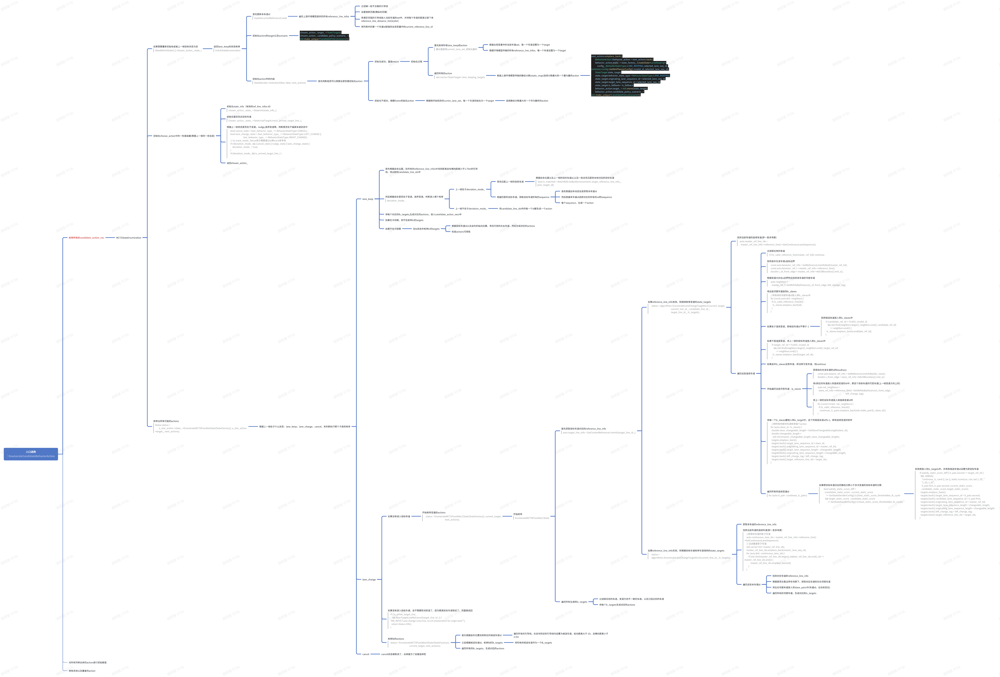

State Decider介绍

[toc]

# 介绍

state_decider是nullmax时空联合高阶框架中的一环，主要负责的是当前状态state以及action的选择。

入口函数是在behavior_mcts_planner中的最后一个内容，semantic_forest_seach中的一环，主要的作用就是枚举出可能得action列表。然后给到下游决策做树搜索。

# 流程框架

## 枚举action

## 

 

**入口函数 EnumerateCandidateBehaviorAction**

- **枚举所有的candidate_action_vec**
  - MCTSStateEnumeration
    - 如果需要重新初始哈或者上一帧目标状态为空 (NeedReInitState() || !chosen_action_.state_)
      - 返回lane_keep的状态枚举 InitLKStateEnumeration
        - 首先更新本车道id UpdateCurrentReferenceLineId
          - 遍历上游环境模型提供的所有reference_line_infos
            - 过滤掉一些不合格的引导线
            - 设置搜索范围(横纵向范围)
            - 将满足范围的引导线放入当前车道的set中，并将每个车道的距离记录下来reference_line_distance_list[id,dist]
            - 将列表中的第一个车道id赋值到全局变量中的current_reference_line_id
        - 初始化action的target以及scenario
          -  chosen_action_.target_ = StateTarget();  chosen_action_.candidate_policy_scenario_ = std::make_unique<CandidatePolicyScenario>();
        - 初始化action中的内容 StateDecider::InitAction(false, false, next_actions)
          - 首先判断是否可以根据全部变量初始化action
            - 初始化成功，直接return
              - 初始化过程
                - 首先枚举所有lane_keep的action 建议直接用current_lane_set_初始化最好
                  - 根据全局变量中的当前车道set，每一个车道设置为一个target
                  - 根据环境模型传输的所有reference_line_infos，每一个车道设置为一个target
                - 遍历所有的action std::vector<StateTarget> lane_keeping_targets
                  - 根据上游环境模型传输的静态分数(static_map)选择分数最大的一个最为最终action
                    - next_actions.emplace_back();         BehaviorAction &behavior_action = next_actions.back();         behavior_action.state_ = state_factory_.CreateState<LaneKeeping>(             config_, BehaviorStateType::LANE_KEEPING, selected_lane_seq_id, common::config::GetNmPlannerConfig().invalid_id, selected_lane_seq_id);         StateTarget state_target;         state_target.behavior_state_type = BehaviorStateType::LANE_KEEPING;         state_target.originating_lane_sequence_id = selected_lane_seq_id;         state_target.target_lane_sequence_id = selected_lane_seq_id;         state_target.is_fallback = is_fallback;         behavior_action.target_ = std::move(state_target);         behavior_action.candidate_policy_scenario_ = std::make_unique<CandidatePolicyScenario>();
            - 初始化不成功，根据frame初始化action
              - 根据刚开始找到的curren_lane_set，每一个车道初始化为一个target
                - 选择静态分数最大的一个作为最终的action
    - 初始化choose_action中的一些基础量(根据上一帧的一些信息)
      - 初始化state_info（有效的ref_line_infos id） chosen_action_.state_->StateInit(state_info_);
      - 初始化是否到达目标车道 chosen_action_.state_->SetArrivalTargetLine(is_arrived_target_line_);
      - 根据上一帧状态是否处于变道，nudge,放弃变道等，判断是否处于偏离车道状态中     bool cancel_state = (last_behavior_type_ == BehaviorStateType::CANCEL);     bool lane_change_state = (last_behavior_type_ == BehaviorStateType::LEFT_CHANGE ||                               last_behavior_type_ == BehaviorStateType::RIGHT_CHANGE);     // id_track_mode_为true表示需要通过id来track参考线     if (!deviation_mode_ && (cancel_state || nudge_state || lane_change_state)) {         deviation_mode_ = true;     }     if (deviation_mode_ && is_arrived_target_line_) {         
      - 返回chosen_action_
    - 枚举出所有可能的actions Status status =         a_star_action->state_->EnumerateMCTSPossibleState(StateFactory(), a_star_action->target_, next_actions);
      - 根据上一帧处于什么状态：lane_keep，lane_change，cancel。来判断执行哪个子类的枚举
        - lane_keep
          - 首先根据自车位置，在所有的reference_line_infos中找到距离自车横向距离小于1.75m的引导线，将id放到candidate_line_ids中
          - 然后根据自车是否处于变道，放弃变道，判断进入哪个枚举 deviation_mode_
            - 上一帧处于deviation_mode_
              - 首先匹配上一帧的目标车道
                - 根据自车位置以及上一帧的目标车道id,以及一些关系匹配到本帧对应的目标车道  bool is_matched = MatchRefLineById(environment, target_reference_line_info_, prev_target_id);
              - 根据匹配的目标车道，获取目标车道所有的sequence
                - 首先根据自车动态信息获取本车道id
                - 然后根据本车道id选择对应的所有的ref的sequence
                - 每个sequence，生成一个action
            - 上一帧不处于deviation_mode_
              - 将candidate_line_ids中的每一个id都生成一个action
          - 将每个对应的lk_targets,生成对应的actions，放入candidate_action_vecs中
          - 如果在冷却期，则不在枚举lc的targets
          - 如果不在冷却期
            - 在lk状态中枚举lc的targets
              - 根据目标车道id以及自车的纵向位置，寻找可变的左右车道，然后生成对应的actions
              - 检查actions可用性
        - lane_change
          - 如果没有进入目标车道
            - 开始枚举变道的actions     status = EnumerateMCTSPossibleLCState(StateFactory(), current_target,                                           next_actions);
              - 开始枚举 EnumerateMCTSPossibleLCState
                - 首先获取目标车道对应的reference_line_info auto target_line_info = GetContextReferenceLineInfo(target_line_id_);
                  - 如果reference_line_info有效，则继续枚举变道的state_targets     status = algorithms::EnumerateLaneChangeTargetInLC(current_target,                                            current_line_id_, candidate_line_id_,                                            target_line_id_, lc_targets);
                    - 找到当前车道的连续车道(即一变多场景)   auto master_ref_line_ids =     master_ref_line_info->reference_line()->GetContinuousLaneSequence();
                    - 遍历这些连续车道
                      - 过滤掉无效的车道  if (!is_valid_reference_line(master_ref_lid)) continue;
                      - 找到自车在该车道s坐标边界     const auto &master_ref_info = GetReferenceLineInfoById(master_ref_lid);     const auto &master_ref_l = master_ref_info->reference_line();     double s_of_front_edge = master_ref_info->AdcSlBoundary().end_s();
                      - 根据变道方向在s边界附近找到该车道的邻居车道     auto neighbors =       master_ref_l->GetRefIdsByDistance(s_of_front_edge, left_change_tag);
                      - 将这些邻居车道放到lc_slaves     //将有效的邻居车道id放入到lc_slaves中     for (const auto &id : neighbors) {       if (is_valid_reference_line(id)){         lc_slaves.emplace_back(id);       }      }
                      - 如果处于连续变道，即候选车道id不等于-1
                        - 则将候选车道放入到lc_slaves中       if (candidate_ref_id != FLAGS_invalid_id           && std::find(neighbors.begin(), neighbors.end(), candidate_ref_id)                == neighbors.end()) {         lc_slaves.emplace_back(candidate_ref_id);       }
                      - 如果不是连续变道，将上一帧的目标车道放入到lc_slaves中       if (target_ref_id != FLAGS_invalid_id           && std::find(neighbors.begin(), neighbors.end(), target_ref_id)                == neighbors.end()) {         lc_slaves.emplace_back(target_ref_id);       }
                      - 如果此时lc_slaves没有车道，即没有可变车道，则continue
                      - 开始遍历这些可变车道：lc_slaves
                        - 获得自车在该车道的s的boudnary       const auto &slave_ref_info = GetReferenceLineInfoById(lc_slave);       double s_front_edge = slave_ref_info->AdcSlBoundary().end_s();
                        - 将s附近的车道放入到连续变道的id中，即这个目标车道的可变车道(上一帧变道方向上的)       auto nei_neighbors =         slave_ref_info->reference_line()->GetRefIdsByDistance(s_front_edge,                                                               left_change_tag);
                        - 将上一帧的目标车道放入到连续变道id中       for (const int &id : nei_neighbors) {         if (is_valid_reference_line(id))           continues_lc_pairs.emplace_back(std::make_pair(lc_slave, id));       }
                      - 将每一个lc_slaves都放入到lc_target中，这个的候选车道id为-1，即非连续变道的枚举       //把所有的相邻车道枚举每个action     for (auto slave_id : lc_slaves) {       double slave_changeable_length = GetSlaveChangeableLength(slave_id);       double changeable_length =         std::min(master_changeable_length, slave_changeable_length);       targets.emplace_back();       targets.back().target_lane_sequence_id = slave_id;       targets.back().originating_lane_sequence_id = master_ref_lid;       targets.back().target_lane_sequence_length = changeable_length;       targets.back().originating_lane_sequence_length = changeable_length;       targets.back().left_change_tag = left_change_tag;       targets.back().target_reference_line_ids = target_ids;     }
                      - 遍历所有的连续变道id for (auto it_pair : continues_lc_pairs)
                        - 如果原目标车道对应的静态分数小于多次变道的目标车道的分数       bool satisfy_static_score_diff =         (candidate_static_score - current_static_score            >= GetStateDeciderConfig().lc2lane_static_score_thresholden_lk_cycle          && target_static_score - candidate_static_score               >= GetStateDeciderConfig().lc2lane_static_score_thresholden_lk_cycle);
                          - 则将其放入到lc_targets中，并将其候选车道id设置为原目标车道       if (satisfy_static_score_diff || it_pair.second == target_ref_id) {         NM_DEBUG(           "continous_lc, cand {}, tar {}, static score(cur, can, tar) {:.2f}, "           "{:.2f}, {:.2f}",           it_pair.first, it_pair.second, current_static_score,           candidate_static_score, target_static_score);         targets.emplace_back();         targets.back().target_lane_sequence_id = it_pair.second;         targets.back().candidate_lane_sequence_id = it_pair.first;         targets.back().originating_lane_sequence_id = master_ref_lid;         targets.back().target_lane_sequence_length = changeable_length;         targets.back().originating_lane_sequence_length = changeable_length;         targets.back().left_change_tag = left_change_tag;         targets.back().target_reference_line_ids = target_ids;       }
                  - 如果reference_line_info无效，则根据目标车道枚举车道保持的state_targets     status =     algorithms::EnumerateLaneChangeTargetInLK(current_line_id_, lc_targets);
                    - 获取本车道的reference_line_info
                    - 找到当前车道的连续车道(即一变多场景)     //获得本车道的影子车道     auto continuous_lane_ids = master_ref_line_info->reference_line()->GetContinuousLaneSequence();     // 过滤重复影子车道     std::vector<int> master_ref_line_ids;     master_ref_line_ids.emplace_back(master_lane_seq_id);     for (auto &id : continuous_lane_ids) {         if (std::find(master_ref_line_ids.begin(), master_ref_line_ids.end(), id) == master_ref_line_ids.end()) {             master_ref_line_ids.emplace_back(id);         }     }
                    - 遍历这些本车道id
                      - 找到对应车道的reference_line_info
                      - 根据是否在靠边停车场景下，获取对应车道的左右邻居车道
                      - 将左右邻居车道放入到slave_pairs中(车道id，左右标志位)
                      - 遍历所有的邻居车道，生成对应的lc_targets
                - 遍历所有生成的lc_targets
                  - 过滤掉无效的车道，变道方向不一致的车道，以及已经达到的车道
                  - 将每个lc_targets生成对应的actions
          - 如果没有进入目标车道，且不需要取消变道了，因为距离目标车道很近了，则直接返回   if (!is_arrive_target_line_       && NearTargetLineNoCancel(target_line_id_)) {    NM_INFO("Lane change cross line, no LK enumeration for origin lane!");     return Status::OK();   }
          - 枚举lk的actions   status = EnumerateMCTSPossibleLKState(StateFactory(),                                         current_target, next_actions);
            - 首先根据自车位置找到附近的候选车道id
              - 遍历所有的引导线，在自车附近的引导线均设置为候选车道，纵向距离大于-10，且横向距离小于2.5m
            - 之后根据候选车道id，枚举lk的lk_targets
              - 将所有的候选车道作为一个lk_targets
            - 遍历所有的lk_targets，生成对应的actions
        - cancel
          - cancel状态被取消了，去掉是为了加强连续性
- 对所有列举出来的action进行初始赋值
- 移除无效以及重复的action

