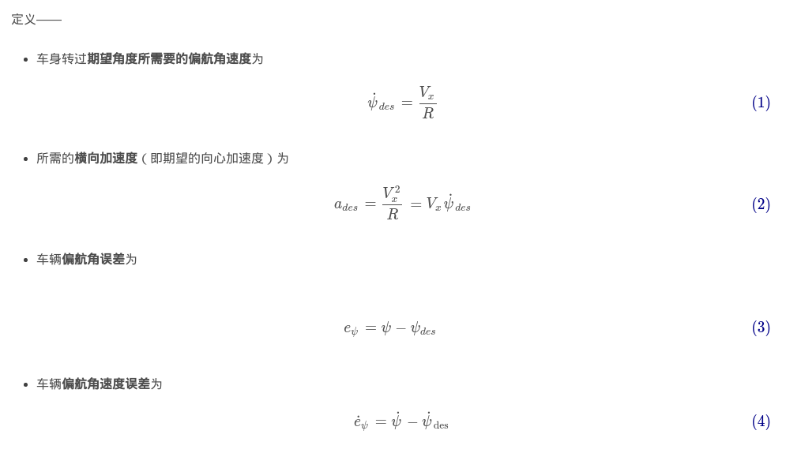
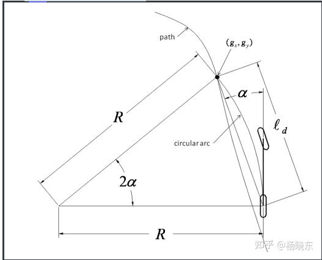

# 控制相关知识

## 基础知识

### 自行车模型的运动学模型推导

  


 

 

 


 

### 自行车模型的动力学模型推导

 

 

 


 

 

  

 

  

### 误差模型


 

 

 

误差动力学模型


 

 


   

 


上面的离散化是用前向欧拉法进行的离散化，还可以用零阶保持法进行离散化

  

## 常用控制算法

### Pure pursit(纯跟踪的PP控制算法)

算法理论

Pure Pursuit方法，顾名思义，纯轨迹跟踪。它是一种基于几何追踪的路径跟随算法，由Craig Coulter于1992年提出。因控制方法较为简单且直接，无须过多考虑车辆的运动学与动力学模型，且调节参数少，可适用于自动驾驶车辆或移动机器人中。

Pure Pursuit算法的基本思想是：参考人类驾驶的行为，通过计算车辆当前位置到预瞄点（goal point）的曲率，使车辆沿着经过预瞄点的圆弧行驶，从而实现轨迹跟踪如下图所示。因此，该算法的核心在于通过设计合理的预瞄距离，从而计算出轨迹跟踪的控制曲率。

 

公式推导

首先简单介绍下自行车控制模型，且假设汽车后轮无法转向，则形成下图单车模型

 

在上图中，有三角正弦定理可知(相关定理看数学文档中的笔记)
$$
{\LARGE\begin{align}tan \delta = \frac{L}{R}\end{align}}
$$
假设现在自车跟踪一条几何轨迹，如下图所示

 

 
$$
{
\LARGE\begin{align}
\frac {sin2\alpha}{L_d} = \frac{sin(\frac{\pi}{2}-\alpha)}{R} \\
\frac{2sin\alpha cos\alpha}{L_d} = \frac{cos\alpha}{R} \\
\frac{2sin\alpha}{L_d} = \frac{1}{R} \\
\end{align}}
$$
将以上式子联系起来可以得到
$$
\LARGE
\begin{align}
\frac{2sin\alpha}{L_d} = \frac{1}{R} = \frac{tan\delta}{L} \\
tan\delta = \frac{2Lsin\alpha}{L_d} \\
sin\alpha = \frac{dy}{L_d} \\
tan\delta = \frac{2dy*L}{L_{d}^2} \\
\delta = arctan\frac{2dy*L}{L_{d}^2}
\end{align}
$$
上式中的$\delta$表示是前轮转角，但是前轮转角与方向盘转角之间还存在一个传动比，因此还需要乘一个传动比系数k,一般都是14.1

所以方向盘转角等于
$$
steel angel = \delta * k = arctan\frac{2dy*L}{L_{d}^2} *k
$$

demo代码

```C++
#pragma section code "vLinkGenLinkerCodeSection_NullMax_Code_text"
#pragma section farrom "vLinkGenLinkerConstSection_NullMax_Const_rodata"
#include "pure_pursuit_hwp.h"
#include "NM_ControlCommom/util/angles.h"
#include "NM_ControlCommom/util/coordinate.h"
#include "NM_DrivingControl/control_common/context/control_context.h"
#include "NM_DrivingControl/control_common/type/ego_car.h"

static bool pure_pursuit_hwp_initialized = false;
static bool first_filter = false;
static float x_velocity_pp[15] = {0.f,  5.f,   10.f,  20.f,  30.f,
                                  40.f, 50.f,  60.f,  70.f,  80.f,
                                  90.f, 100.f, 110.f, 120.f, 130.f};  //速度
static float x_velocity_compensation[13] = {10.f,  20.f,  30.f, 40.f, 50.f,
                                            60.f,  70.f,  80.f, 90.f, 100.f,
                                            110.f, 120.f, 130.f};  //速度
static float x_velocity_compensation_high_curve[13] = {
    60.f, 60.f, 60.f, 60.f, 60.f, 60.f, 60.f,
    60.f, 60.f, 60.f, 60.f, 60.f, 60.f};  //速度
static float x_velocity_compensation_low_curve[13] = {
    60.f, 60.f,  60.f, 60.f, 60.f, 60.f, 60.f,
    60.f, 37.5f, 37.f, 37.f, 37.f, 37.f};  //速度
static float y_steer_angle_max_pp[15] = {
    460.f, 460.f, 460.f, 277.f, 127.f, 72.f, 46.f, 32.f,
    24.f,  18.f,  15.f,  12.f,  9.f,   7.f,  5.f};  //速度-方向盘角度
static float y_steer_rate_max_pp[15] = {
    400.f, 400.f, 350.f, 300.f, 270.f, 240.f, 210.f, 180.f,
    150.f, 120.f, 90.f,  60.f,  50.f,  40.f,  30.f};  //速度-方向盘最大角速度
const float KAckermannWheelbase = 2.8;
const float KSteeringRatio = 14.1;
const float kAngleRadianRatio = 57.3;
bool PurePursuitHwpFollowerInit(PurePursuitHwpFollower *follower) {
  //  static bool initialized = false;
  if (pure_pursuit_hwp_initialized) {
    return true;
  }
  follower->lss_scale = 2.5f;
  follower->angular_v_ratio = 1.f;
  follower->front_wheel_angle_directly_prev = false;
  follower->use_self_calibration_steer_angle = false;
  follower->front_wheel_angle_cmd = 0.f;
  FirstOrderLowPassFilterInitWithParam(
      &(follower->front_wheel_angle_cmd_filter), 0.02f, 0.1f);
  FirstOrderLowPassFilterInitWithParam(&(follower->baselink_y_filter), 0.02f,
                                       0.08f);
  FirstOrderLowPassFilterInitWithParam(&(follower->yaw_rate_cmd_filter), 0.02f,
                                       0.08f);
  // BiquadFilterInitWithParam(&(follower->yaw_rate_cmd_filter),
  //                           BIQUAD_PASS_TYPE_LOW_PASS, 0.1f, 0.11f);
  FirstOrderLowPassFilterInitWithParam(&(follower->linear_velocity_filter),
                                       0.02f, 0.005f);
  MeanFilterInit(&(follower->raw_rate_compentation_filter));
  MeanFilterInit(&(follower->steer_angle_bias_filter));
  PidControlInit(&(follower->steer_pid));
  PidControlSetGains(&(follower->steer_pid), 0.9, 0, 0);
  PidControlSetTimeInertia(&(follower->steer_pid), 0.05);
  pure_pursuit_hwp_initialized = true;
  return true;
}

bool PurePursuitHwpFollowerRunOnce(PurePursuitHwpFollower *follower) {
  ControlContext *control_context = ControlContextSingletonInstance();
  // while control reset then reset linear_velocity filter
  if (control_context->lat_controllor_reset) {
    FirstOrderLowPassFilterResetValue(
        &(follower->linear_velocity_filter),
        control_context->ego_car_state.linear_velocity);
    MeanFilterReset(&(follower->raw_rate_compentation_filter),
                    (control_context->ego_car_state.raw_angular_velocity -
                     control_context->angular_velocity_filted));
    MeanFilterReset(&(follower->steer_angle_bias_filter), 0.0f);
  }
  // for linear_vel add the filter
  follower->linear_velocity_filted = FirstOrderLowPassFilterProcessMeasurement(
      &(follower->linear_velocity_filter),
      control_context->ego_car_state.linear_velocity);
  control_context->mcu_to_soc_ctrl_monitor.mcu_to_soc_lat_ctrl_monitor
      .current_linear_velocity = follower->linear_velocity_filted;
  // and when icc active target point use icc points
  follower->target_position.x = control_context->lateral_control_point.wpa.x;
  follower->target_position.y = control_context->lateral_control_point.wpa.y;
  follower->target_position.z = control_context->lateral_control_point.wpa.r;
  follower->front_wheel_angle_directly = false;
  // cal kappa
  PurePursuitHwpFollowerCalcCurvature(follower);
  // yaw_rate = kappa * v;
  follower->yaw_rate_cmd = follower->kappa * follower->linear_velocity_filted;
  // when control use front_wheel_angle first then reset
  if (follower->front_wheel_angle_directly_prev !=
      follower->front_wheel_angle_directly) {
    first_filter = true;
  } else {
    first_filter = false;
  }
  // update prev directly
  follower->front_wheel_angle_directly_prev =
      follower->front_wheel_angle_directly;
  // cal front_wheel_angle_rate_max and front_wheel_angle_max
  PurePursuitHwpFollowerCmdLimit(follower);
  // cal yaw_cmd compentation
  PurePursuitHwpFollowerCalYawRateCompensate(follower);
  // cal yaw_rate_filter
  PurePursuitHwpFollowerFilterTwistCommand(follower);
  // cal front_wheel_angle_cmd_by_yawrate
  PurePursuitHwpFollowerSteeringControl(follower);
  // cal cmd_front_wheel_angle to control
  PurePursuitHwpFollowerSteeringPostProcess(follower);
  control_context->mcu_to_soc_ctrl_monitor.lat_pp_monitor
      .front_wheel_angle_directly = follower->front_wheel_angle_directly;
  control_context->mcu_to_soc_ctrl_monitor.lat_pp_monitor.yaw_rate_cmd =
      follower->yaw_rate_cmd;
  control_context->mcu_to_soc_ctrl_monitor.lat_pp_monitor.target_position_x =
      follower->target_position.x;
  control_context->mcu_to_soc_ctrl_monitor.lat_pp_monitor.target_position_y =
      follower->target_position.y;
  control_context->mcu_to_soc_ctrl_monitor.lat_pp_monitor.target_position_z =
      follower->target_position.z;
  return true;
}

void PurePursuitHwpFollowerCmdLimit(PurePursuitHwpFollower *follower) {
  ControlContext *control_context = ControlContextSingletonInstance();
  // from the vel interpolate the max front_wheel_angle and the max
  // front_wheel_angle_rate
  follower->front_wheel_angle_max =
      Hwp_Interpolate(x_velocity_pp, y_steer_angle_max_pp,
                      follower->linear_velocity_filted * 3.6f) /
      KSteeringRatio / kAngleRadianRatio;
  follower->front_wheel_angle_rate_max =
      Hwp_Interpolate(x_velocity_pp, y_steer_rate_max_pp,
                      follower->linear_velocity_filted * 3.6f) /
      KSteeringRatio / kAngleRadianRatio / 50.f;
  control_context->mcu_to_soc_ctrl_monitor.mcu_to_soc_lat_ctrl_monitor
      .cmd_front_wheel_angle_curvature_max = follower->front_wheel_angle_max;
  control_context->mcu_to_soc_ctrl_monitor.mcu_to_soc_lat_ctrl_monitor
      .cmd_front_wheel_angle_lateral_errorP_max =
      follower->front_wheel_angle_rate_max;
}

void PurePursuitHwpFollowerCalcCurvature(PurePursuitHwpFollower *follower) {
  ControlContext *control_context = ControlContextSingletonInstance();
  Point3Vector predict_odom_point;
  // cmd send util run need time delay
  const float time_delay = control_context->control_calibration_parameter
                               .calibration_lateral.target_delay;
  // delay distance = v * time_delay
  const float distance_delay = follower->linear_velocity_filted * time_delay;
  // delay yaw = w * time_delay
  const float yaw_delay =
      control_context->ego_car_state.angular_velocity * time_delay;
  // base bicycle model to cal after time_delay the odom point
  predict_odom_point.x =
      control_context->odom_pose_point.x +
      distance_delay *
          cosf(control_context->odom_pose_point.z + 0.5f * yaw_delay);
  predict_odom_point.y =
      control_context->odom_pose_point.y +
      distance_delay *
          sinf(control_context->odom_pose_point.z + 0.5f * yaw_delay);
  predict_odom_point.z =
      normalize_angle(control_context->odom_pose_point.z + yaw_delay);
  // base bicycle model
  // kappa = (2 * y) / (ld * ld)
  follower->denominator =
      Distance2DSquare(follower->target_position.x, follower->target_position.y,
                       predict_odom_point.x, predict_odom_point.y);
  // convert to baselink coordinate to cal y
  Hwp_ConvertPointToRelativeCoordinate(&(follower->target_position),
                                       &predict_odom_point,
                                       &(follower->target_position_baselink));
  if (control_context->lat_controllor_reset) {
    FirstOrderLowPassFilterResetValue(&(follower->baselink_y_filter), 0.0);
  }
  follower->target_position_baselink.y =
      FirstOrderLowPassFilterProcessMeasurement(
          &(follower->baselink_y_filter), follower->target_position_baselink.y);
  follower->target_position_baselink.y =
      fmaxf(follower->target_position_baselink.y, -kMaxBaselinkY);
  follower->target_position_baselink.y =
      fminf(follower->target_position_baselink.y, kMaxBaselinkY);
  follower->numerator = 2.f * follower->target_position_baselink.y;
  // ld > sqrt(10m)
  if (follower->denominator > kEpsilonDistanceHwpPP) {
    float kp = 1.f;
    follower->kappa = kp * follower->numerator / follower->denominator;
    follower->kappa = fmaxf(follower->kappa, -0.02f);
    follower->kappa = fminf(follower->kappa, 0.02f);
  } else {
    follower->kappa = 0.f;
  }
  // monitor-predict odom
  control_context->mcu_to_soc_ctrl_monitor.mcu_to_soc_lat_ctrl_monitor
      .predict_point.x = predict_odom_point.x;
  control_context->mcu_to_soc_ctrl_monitor.mcu_to_soc_lat_ctrl_monitor
      .predict_point.y = predict_odom_point.y;
  control_context->mcu_to_soc_ctrl_monitor.mcu_to_soc_lat_ctrl_monitor
      .predict_point.z = predict_odom_point.z;
  // monitor-odom
  control_context->mcu_to_soc_ctrl_monitor.mcu_to_soc_lat_ctrl_monitor
      .current_point.x = control_context->odom_pose_point.x;
  control_context->mcu_to_soc_ctrl_monitor.mcu_to_soc_lat_ctrl_monitor
      .current_point.y = control_context->odom_pose_point.y;
  control_context->mcu_to_soc_ctrl_monitor.mcu_to_soc_lat_ctrl_monitor
      .current_point.z = control_context->odom_pose_point.z;
  // add runonce result to monitor
  control_context->mcu_to_soc_ctrl_monitor.lat_pp_monitor
      .target_position_baselink_x = follower->target_position_baselink.x;
  control_context->mcu_to_soc_ctrl_monitor.lat_pp_monitor
      .target_position_baselink_y = follower->target_position_baselink.y;
  control_context->mcu_to_soc_ctrl_monitor.lat_pp_monitor.numerator =
      follower->numerator;
  control_context->mcu_to_soc_ctrl_monitor.lat_pp_monitor.denominator =
      follower->denominator;
  control_context->mcu_to_soc_ctrl_monitor.lat_pp_monitor.kappa =
      follower->kappa;
}
void PurePursuitHwpFollowerCalYawRateCompensate(
    PurePursuitHwpFollower *follower) {
  ControlContext *control_context = ControlContextSingletonInstance();
  follower->use_self_calibration_steer_angle = false;
  float angular_compensation_velocity = 1.0f;
  // if (follower->kappa >= 0.002f) {  // 500m
  //   angular_compensation_velocity = Hwp_Interpolate(
  //       x_velocity_compensation, x_velocity_compensation_high_curve,
  //       control_context->ego_car_state.display_velocity *
  //           3.6f);  //大曲率速度差值
  // } else {
  //   angular_compensation_velocity = Hwp_Interpolate(
  //       x_velocity_compensation, x_velocity_compensation_low_curve,
  //       control_context->ego_car_state.display_velocity *
  //           3.6f);  //小曲率速度差值
  // }
  angular_compensation_velocity = Hwp_Interpolate(
      x_velocity_compensation, x_velocity_compensation_low_curve,
      control_context->ego_car_state.display_velocity * 3.6f);  //曲率速度差值
  if (control_context->control_calibration_parameter.calibration_pp_lateral
          .angular_compensation_velocity <= 150.0f) {
    angular_compensation_velocity =
        control_context->control_calibration_parameter.calibration_pp_lateral
            .angular_compensation_velocity;
  }
  if (control_context->control_input.trick_vars.in_curvature) {
    follower->yaw_rate_cmd =
        follower->yaw_rate_cmd *
        (1.0f +
         (follower->linear_velocity_filted * follower->linear_velocity_filted) /
             (angular_compensation_velocity * 45.0f));
  }
  float raw_rate_compensate = 0.0f;
  if ((control_context->control_input.trick_vars.in_curvature ||
       control_context->control_input.trick_vars.changing_status ==
           LANE_CHANGING_STATUS_CHANGING ||
       control_context->control_input.trick_vars.changing_status ==
           LANE_CHANGING_STATUS_ABORT) &&
      control_context->is_calibration_success) {
    follower->use_self_calibration_steer_angle = true;
    raw_rate_compensate = 0.0f;
  } else {
    raw_rate_compensate = control_context->ego_car_state.raw_angular_velocity -
                          control_context->angular_velocity_filted;
  }
  raw_rate_compensate = MeanFilterProcessMeasurement(
      &(follower->raw_rate_compentation_filter), raw_rate_compensate);
  follower->yaw_rate_cmd_compensation =
      follower->yaw_rate_cmd + raw_rate_compensate;
  control_context->mcu_to_soc_ctrl_monitor.lat_pp_monitor.in_curvature =
      control_context->control_input.trick_vars.in_curvature;
  control_context->mcu_to_soc_ctrl_monitor.lat_pp_monitor
      .yaw_rate_cmd_filted_ratio = follower->yaw_rate_cmd_compensation;
}

void PurePursuitHwpFollowerFilterTwistCommand(
    PurePursuitHwpFollower *follower) {
  ControlContext *control_context = ControlContextSingletonInstance();
  // reset angular v filter
  if (control_context->lat_controllor_reset) {
    FirstOrderLowPassFilterResetValue(
        &(follower->yaw_rate_cmd_filter),
        control_context->ego_car_state.raw_angular_velocity);
  }
  FirstOrderLowPassFilterSetParam(
      &(follower->yaw_rate_cmd_filter),
      control_context->control_calibration_parameter.calibration_lateral
          .cmd_front_wheel_angle_filt_coef);
  follower->yaw_rate_cmd_filted = FirstOrderLowPassFilterProcessMeasurement(
      &(follower->yaw_rate_cmd_filter), follower->yaw_rate_cmd_compensation);
  LimitYawRateCmd(follower);
}
void LimitYawRateCmd(PurePursuitHwpFollower *follower) {
  ControlContext *control_context = ControlContextSingletonInstance();
  // 限值yaw_rate_cmd_filted变化率
  static float lowpass_angular_z = 0.;
  static bool prev_pub_lat_cmd_pp = false;
  float maximum_delta_angular;
  if (!control_context->control_input.trick_vars.in_curvature &&
      follower->linear_velocity_filted < 5.0) {
    maximum_delta_angular = kMaxStepDeltaAngular;
  } else {
    maximum_delta_angular = 0.004;
  }
  if (control_context->pub_lat_cmd && false == prev_pub_lat_cmd_pp) {
    lowpass_angular_z = control_context->ego_car_state.raw_angular_velocity;
  }
  prev_pub_lat_cmd_pp = control_context->pub_lat_cmd;

  float angular = follower->yaw_rate_cmd_filted;
  if (angular > lowpass_angular_z) {
    angular = fminf(angular, lowpass_angular_z + maximum_delta_angular);
  } else if (angular < lowpass_angular_z) {
    angular = fmaxf(angular, lowpass_angular_z - maximum_delta_angular);
  }
  if (!control_context->pub_lat_cmd) {
    lowpass_angular_z = control_context->ego_car_state.raw_angular_velocity;
  } else {
    lowpass_angular_z = angular;
  }
  follower->yaw_rate_cmd_filted = angular;
  // 限制微小摆动
  if (control_context->control_input.trick_vars.in_curvature == false &&
      control_context->control_input.trick_vars.changing_status !=
          LANE_CHANGING_STATUS_CHANGING) {
    // low speed filter larger angular noise
    if (fabs(follower->yaw_rate_cmd_filted) <= kMaxYawRateCmdLimit) {
      follower->yaw_rate_cmd_filted = 0.;
    }
  } else if (fabs(follower->yaw_rate_cmd_filted) <= kMaxYawRateCmdLimit) {
    follower->yaw_rate_cmd_filted = 0.;
  }
  control_context->mcu_to_soc_ctrl_monitor.lat_pp_monitor.yaw_rate_cmd_filted =
      follower->yaw_rate_cmd_filted;
}

void PurePursuitHwpFollowerSteeringControl(PurePursuitHwpFollower *follower) {
  ControlContext *control_context = ControlContextSingletonInstance();
  static float last_target_steering_angle = 0.0f;
  float target_steering_angle = 0.f;
  if (control_context->lat_controllor_reset || !control_context->pub_lat_cmd) {
    last_target_steering_angle = 0.0f;
  }
  if (follower->linear_velocity_filted > 1.2) {
    target_steering_angle =
        KSteeringRatio *
        atanf(KAckermannWheelbase * follower->yaw_rate_cmd_filted /
              follower->linear_velocity_filted);
  } else {
    target_steering_angle = last_target_steering_angle;
  }
  last_target_steering_angle = target_steering_angle;
  control_context->mcu_to_soc_ctrl_monitor.lat_pp_monitor
      .target_steering_angle = target_steering_angle;

  float current_steering_angle = 0.f;
  float radius = 0.f;

  // cal current steer angle
  radius = control_context->ego_car_state.linear_velocity /
           control_context->angular_velocity_filted;
  if (fabsf(radius) > 0.001f) {
    current_steering_angle =
        KSteeringRatio * atan(KAckermannWheelbase / radius);
  }
  control_context->mcu_to_soc_ctrl_monitor.lat_pp_monitor
      .current_steering_angle = current_steering_angle;
  control_context->mcu_to_soc_ctrl_monitor.mcu_to_soc_lat_ctrl_monitor
      .current_steering_wheel_angle =
      control_context->ego_car_state.steering_wheel_angle;
  float steering_err = target_steering_angle - current_steering_angle;
  control_context->mcu_to_soc_ctrl_monitor.lat_pp_monitor.steering_err =
      steering_err;
  follower->front_wheel_angle_cmd_by_yawrate =
      target_steering_angle / KSteeringRatio;
}

void PurePursuitHwpFollowerSteeringPostProcess(
    PurePursuitHwpFollower *follower) {
  ControlContext *control_context = ControlContextSingletonInstance();
  // from v to control
  if (true == follower->front_wheel_angle_directly) {
    follower->front_wheel_angle_cmd = follower->front_wheel_angle_cmd_directly;
  } else {
    follower->front_wheel_angle_cmd =
        follower->front_wheel_angle_cmd_by_yawrate;
  }
  if (control_context->lat_controllor_reset || first_filter) {
    FirstOrderLowPassFilterResetValue(
        &(follower->front_wheel_angle_cmd_filter),
        control_context->ego_car_state.steering_wheel_angle / KSteeringRatio);
  }
  follower->front_wheel_angle_cmd =
      fminf(follower->front_wheel_angle_cmd, follower->front_wheel_angle_max);
  follower->front_wheel_angle_cmd =
      fmaxf(follower->front_wheel_angle_cmd, -follower->front_wheel_angle_max);
  if (!control_context->pub_lat_cmd) {
    follower->front_wheel_angle_cmd =
        control_context->ego_car_state.steering_wheel_angle;
  }
  control_context->mcu_to_soc_ctrl_monitor.lat_pp_monitor
      .front_wheel_angle_cmd = follower->front_wheel_angle_cmd * KSteeringRatio;
  // cmd_front_angle filter
  // go in icc no large steer
  follower->front_wheel_angle_cmd_filter_coef +=
      control_context->control_calibration_parameter.calibration_pp_lateral
          .curve_scale;
  // 0.001f;
  follower->front_wheel_angle_cmd_filter_coef =
      fminf(follower->front_wheel_angle_cmd_filter_coef, 0.2f);
  FirstOrderLowPassFilterSetParam(&(follower->front_wheel_angle_cmd_filter),
                                  follower->front_wheel_angle_cmd_filter_coef);
  follower->front_wheel_angle_cmd_filted =
      FirstOrderLowPassFilterProcessMeasurementWithStepBound(
          &(follower->front_wheel_angle_cmd_filter),
          follower->front_wheel_angle_cmd,
          follower->front_wheel_angle_rate_max);
  control_context->mcu_to_soc_ctrl_monitor.lat_pp_monitor
      .front_wheel_angle_cmd_filted =
      follower->front_wheel_angle_cmd_filted * KSteeringRatio;
  float steer_angle_bias = 0.0f;
  if (follower->use_self_calibration_steer_angle) {
    steer_angle_bias = control_context->front_wheel_bias / KSteeringRatio;
  } else {
    steer_angle_bias = 0.0f;
  }
  steer_angle_bias = MeanFilterProcessMeasurement(
      &(follower->steer_angle_bias_filter), steer_angle_bias);
  control_context->cmd_front_wheel_angle =
      follower->front_wheel_angle_cmd_filted + steer_angle_bias;
  control_context->mcu_to_soc_ctrl_monitor.lat_pp_monitor
      .cmd_front_wheel_angle =
      control_context->cmd_front_wheel_angle * KSteeringRatio;
}

#pragma section code restore
#pragma section farrom restore
```


### Purea pursit-Stanely

算法理论

Stanely控制算法是一种基于横向跟踪误差(cross-track error)的控制方法，能够实线横向跟踪误差指数收敛于0.

 

Stanely控制算法的主要思想就是根据自车位姿以及给定的几何路径，计算与自车最近的几何路径点，根据该路径点的朝向以及与自车之间的横向误差计算自车跟随轨迹所需要的航向角。
$$
\LARGE
\begin{align}
\delta(t) = \delta_e(t)+\delta_{\theta_e}(t)
\end{align}
$$
式中$\delta(t)$表示前轮转角，$\delta_e(t)$表示根据横向误差计算出来的前轮转角，$\delta_{\theta_e}(t)$表示最近路径点对应的航向角

公式推导

首先在不考虑横向跟踪误差$e$的情况下，前轮偏角应该和给定路径切线方向是一致的，如上图所示。其中$\theta_e$表示车辆航向与最近路径点切线方向之间的夹角，在没有任何横向误差的情况下，前轮的方向与所在的路径点的方向应该是相同的，因此
$$
\LARGE
\begin{align}
\delta_{\theta_t}(t) = \theta_e(t)
\end{align}
$$
在不考虑航向跟踪误差$\theta_e$的情况下，横向跟踪误差越大，前轮转向角越大，假设车辆预期轨迹在距离前轮$d(t)$处与给定路径上最近点切线相交，根据几何关系得出如下非线性比例函数：
$$
\LARGE
\begin{align}
\delta_e(t) = arctan\frac{e(t)}{d(t)} = arctan\frac{ke(t)}{v(t)}
\end{align}
$$
其中$d(t)$与车速相关，最后用车速$v(t)$，增益系数k表示。随着横向误差的增加，$arctan$函数产生一个直接指向期望路径的前轮偏角，并且收敛速度受车速$v(t)$限制

因此Stanely控制算法的转角控制率如下：
$$
\LARGE
\begin{align}
\delta(t) = \theta_e(t)+arctan\frac{ke(t)}{v(t)}
\end{align}
$$
误差推导

使用线性自行车运动模型，可以得到横向误差的变化率
$$
\LARGE
\begin{align}
\dot{e}(t)=-v(t)sin\delta_e(t)
\end{align}
$$
其中
$$
\LARGE
\begin{align}
sin\delta_e(t) = \frac{e(t)}{\sqrt{d(t)^2+e(t)^2}} = \frac{ke(t)}{\sqrt{v(t)^2+(ke(t))^2}} \\
\dot{e}(t) = \frac{-v(t)ke(t)}{\sqrt{v(t)^2+(ke(t))^2}} = \frac{-ke(t)}{\sqrt{1+(\frac{ke(t)}{v(t)})^2}}
\end{align}
$$
当横向跟踪误差$e(t)$很小时，$(\frac{ke(t)}{v(t)})^2->0$

所以$\dot{e}(t) \approx-ke(t)$

通过积分上式：$e(t)=e(0) \cross{}e^{-kt}$

因此横向误差指数收敛与e(t)=0,参数k决定了收敛速度，对于任意横向误差，微分方程都单调的收敛到0

### PID控制算法


### LQR控制算法

介绍

如果所研究的系统是线性的，且性能指标为状态变量和控制变量的二次型函数，则最优控制问题称为线性二次型问题。LQR，Linear Quadratic Regulator，即线性二次型调节器， 是求解线性二次型问题常用的求解方法。

LQR ，其对象是现代控制理论中以状态空间形式给出的线性系统，而目标函数为对象状态和控制输入的二次型函数。

LQR最优设计是指设计出的状态反馈控制器 K要使二次型目标函数J 取最小值，而 K由权矩阵Q 与 R 唯一决定，故此 Q、 R 的选择尤为重要。

LQR理论是现代控制理论中发展最早也最为成熟的一种状态空间设计法。特别可贵的是，LQR可得到状态线性反馈的最优控制规律，易于构成闭环最优控制。

 

LQR算法的输出

 

 

#### 反馈矩阵K的求解

连续时间计算方式

 

 


 

离散时间计算方式

计算原理与连续时间基本一致，目的是使目标函数极小

但是离散时间的计算方式需要按照离散时间去推导，推导方式为动态规划法：


推导过程：

[推导教程链接](https://zgh551.github.io/2020/02/20/%E5%9F%BA%E7%A1%80%E7%AE%97%E6%B3%95-LQR-%E7%A6%BB%E6%95%A3%E6%97%B6%E9%97%B4%E6%9C%89%E9%99%90%E8%BE%B9%E7%95%8C/)  

 

 

 


####   横向误差计算


 横向位置偏差


#### 前馈模块

 

 

 

   

demo代码

离线生产lqr k 矩阵的代码

```C++
void GetOfflineLqrKMatrix() {
  NM_WARN("=====GetOfflineLqrKMatrix");
  double v = 10;  // v>5
  // double v_step = 1;  // v_step = 1kph
  const int states = 4;
  const int controls = 1;
  const int max_iter = 10000;
  const double eps = 0.001;
  unsigned int iter = 0;
  double err = 0.0;
  nullmax::common::Interpolation lat_err_interpolation;
  nullmax::common::Interpolation heading_err_interpolation;
  nullmax::common::Interpolation::InterpolatData xy1, xy2;
  nullmax::control::KineticalModel kinetical_model;
  kinetical_model.InitStateParams();
  double lat_err_gain_15 = 0.8;
  double lat_err_gain_30 = 0.6;
  double lat_err_gain_60 = 0.2;
  double lat_err_gain_80 = 0.15;
  double lat_err_gain_100 = 0.1;
  double lat_err_gain_120 = 0.1;
  double lat_err_gain_135 = 0.1;
  xy1.emplace_back(std::make_pair(15., const_cast<double *>(&lat_err_gain_15)));
  xy1.emplace_back(std::make_pair(30., const_cast<double *>(&lat_err_gain_30)));
  xy1.emplace_back(std::make_pair(60., const_cast<double *>(&lat_err_gain_60)));
  xy1.emplace_back(std::make_pair(80., const_cast<double *>(&lat_err_gain_80)));
  xy1.emplace_back(
      std::make_pair(100., const_cast<double *>(&lat_err_gain_100)));
  xy1.emplace_back(
      std::make_pair(120., const_cast<double *>(&lat_err_gain_120)));
  xy1.emplace_back(
      std::make_pair(135., const_cast<double *>(&lat_err_gain_135)));
  lat_err_interpolation.Init(xy1);

  double heading_err_gain_4 = 0.8;
  double heading_err_gain_8 = 0.6;
  double heading_err_gain_12 = 0.4;
  double heading_err_gain_20 = 0.3;
  double heading_err_gain_25 = 0.2;
  xy2.emplace_back(
      std::make_pair(4., const_cast<double *>(&heading_err_gain_4)));
  xy2.emplace_back(
      std::make_pair(8., const_cast<double *>(&heading_err_gain_8)));
  xy2.emplace_back(
      std::make_pair(12., const_cast<double *>(&heading_err_gain_12)));
  xy2.emplace_back(
      std::make_pair(20., const_cast<double *>(&heading_err_gain_20)));
  xy2.emplace_back(
      std::make_pair(25., const_cast<double *>(&heading_err_gain_25)));
  heading_err_interpolation.Init(xy2);
  // double q0 = 0.12;
  // NM_WARN("q0:{}", q0);
  Eigen::MatrixXd Q = Eigen::MatrixXd::Zero(states, states);
  Eigen::MatrixXd R = Eigen::MatrixXd::Zero(controls, controls);
  Eigen::MatrixXd K = Eigen::MatrixXd::Zero(controls, states);
  Eigen::MatrixXd K_0 = Eigen::MatrixXd::Zero(1, 135);
  Eigen::MatrixXd K_1 = Eigen::MatrixXd::Zero(1, 135);
  Eigen::MatrixXd K_2 = Eigen::MatrixXd::Zero(1, 135);
  Eigen::MatrixXd K_3 = Eigen::MatrixXd::Zero(1, 135);
  for (size_t i = 0; i < 135; i++) {
    v = i / 3.6;
    Q(0, 0) = 0.5;
    Q(1, 1) = 0.0;
    // Q(2, 2) = 1.0 * heading_err_interpolation.Interpolate(v);
    Q(2, 2) = 1.0;
    Q(3, 3) = 0.0;
    R(0, 0) = 200.0;
    NM_WARN(
        "SolveLQRProblem Q, R:, v is {}, Q0:{}, Q1{}, "
        "Q2{}, Q3{},R{}",
        i, Q(0, 0), Q(1, 1), Q(2, 2), Q(3, 3), R(0, 0));
    // R(0, 0) = 250.0;
    kinetical_model.model_state_.current_velocity = v;
    kinetical_model.UpdateStateMatrix();
    auto start_time_lqr = std::chrono::system_clock::now();
    auto res = nullmax::common::lqr_solver::SolveLQRProblem(
        kinetical_model.GD_, kinetical_model.HD_, Q, R, eps, max_iter, K, iter,
        err);
    auto end_time_lqr = std::chrono::system_clock::now();
    std::chrono::duration<double> diff_lqr = end_time_lqr - start_time_lqr;
    if (res) {
      NM_WARN(
          "SolveLQRProblem success, v:{}km/h, LQR used time:{}ms, k:{}, {}, "
          "{}, {}",
          i, diff_lqr.count() * 1000, K(0), K(1), K(2), K(3));
      // NM_WARN_STREAM("K is :" << K);
      K_0(i) = K(0);
      K_1(i) = K(1);
      K_2(i) = K(2);
      K_3(i) = K(3);
    } else {
      NM_WARN("SolveLQRProblem failed, v:{}km/h, iteration times:{}, error:{}",
              i, iter, err);
    }
  }
  NM_WARN("Matrix K0 is \n");
  for (int k = 0; k < 135; ++k) {
    std::cout << " " << K_0(k) << ","
              << " ";
  }
  std::cout << " " << std::endl;
  NM_WARN("Matrix K1 is \n");
  for (int k = 0; k < 135; ++k) {
    std::cout << " " << K_1(k) << ","
              << " ";
  }
  std::cout << " " << std::endl;
  NM_WARN("Matrix K2 is \n");
  for (int k = 0; k < 135; ++k) {
    std::cout << " " << K_2(k) << ","
              << " ";
  }
  std::cout << " " << std::endl;
  NM_WARN("Matrix K3 is \n");
  for (int k = 0; k < 135; ++k) {
    std::cout << " " << K_3(k) << ","
              << " ";
  }
  std::cout << " " << std::endl;
}


bool SolveLQRProblem(const Eigen::MatrixXd &GD, const Eigen::MatrixXd &HD,
                     const Eigen::MatrixXd &Q, const Eigen::MatrixXd &R,
                     const double tolerance,
                     const unsigned int max_num_iteration,
                     Eigen::MatrixXd &ptr_K, unsigned int &out_iteration_num,
                     double &out_err) {
  Eigen::MatrixXd P = Q;  // init P=S=Q P(k)
  std::ostringstream ss;
  ss << "G Matrix\n" << GD << std::endl;
  ss << "H Matrix\n" << HD << std::endl;
  ss << "Q Matrix\n" << Q << std::endl;
  ss << "R Matrix\n" << R << std::endl;
  NM_DEBUG(ss.str());
  Eigen::MatrixXd GD_T = GD.transpose();
  Eigen::MatrixXd HD_T = HD.transpose();
  unsigned int iteration_num = 0;
  double err = std::numeric_limits<double>::max();
  clock_t t;
  t = clock();
  NM_DEBUG("lqr--before solve");
  while (err > tolerance && iteration_num < max_num_iteration) {
    iteration_num++;
    Eigen::MatrixXd P_MO =
        Q +
        GD_T * P * (GD - HD * (R + HD_T * P * HD).inverse() * HD_T * P * GD);
    err = fabs((P_MO - P).maxCoeff());
    P = P_MO;
  }
  NM_DEBUG("lqr--end solve {}", iteration_num);
  out_iteration_num = iteration_num;
  out_err = err;
  if (iteration_num >= max_num_iteration) {
    NM_ERROR("Over iterate ERR= {}", err);
    t = clock() - t;
    NM_DEBUG_STREAM("It took me " << (static_cast<double>(t) / CLOCKS_PER_SEC)
                                  << " seconds");
    return false;

  } else {
    ptr_K = (R + HD.transpose() * P * HD).inverse() * HD.transpose() * P * GD;
    return true;
  }
}


```


lqr控制算法代码

```C++
#include "lateral_control/lateral_follower/lqr_cherry_follower.h"

#include <sys/time.h>

#include "config/global_config/global_config.h"
#include "control_common/control_config/control_config.h"
#include "lqr_solver/lqr_solver.h"

namespace nullmax {
namespace control {
//原始的
// double K_0_0_array[116] = {
//     0.0141217,  0.0141177,  0.0141137,  0.0141097,  0.0141057,  0.0141017,
//     0.0140977,  0.0140937,  0.0140896,  0.0140857,  0.0140083,  0.0138812,
//     0.0137532,  0.0136241,  0.0134939,  0.0133627,  0.0132303,  0.0130968,
//     0.0129621,  0.0128261,  0.0126888,  0.0125502,  0.0124103,  0.0122689,
//     0.0120979,  0.0118099,  0.011515,   0.0112126,  0.0109022,  0.010583,
//     0.0102541,  0.00991465, 0.00956343, 0.00919909, 0.00881998, 0.00842407,
//     0.00800886, 0.00757113, 0.00710666, 0.00698472, 0.00695289, 0.00692094,
//     0.00688888, 0.0068567,  0.0068244,  0.00679197, 0.00675942, 0.00672674,
//     0.00669393, 0.006661,   0.00662792, 0.00659471, 0.00656137, 0.00652788,
//     0.00649425, 0.00646048, 0.00642656, 0.00639248, 0.00635826, 0.00632388,
//     0.00628935, 0.00625465, 0.00621978, 0.00618476, 0.00614956, 0.00611419,
//     0.00607864, 0.00604292, 0.00598601, 0.00592861, 0.00587068, 0.00581222,
//     0.00575321, 0.00569363, 0.00563346, 0.00557268, 0.00551127, 0.00544921,
//     0.00538648, 0.00532305, 0.0052589,  0.00519399, 0.0051283,  0.00506179,
//     0.00499444, 0.00492621, 0.00492543, 0.00492465, 0.00492387, 0.0049231,
//     0.00492233, 0.00492156, 0.00492079, 0.00492002, 0.00491924, 0.00491848,
//     0.00491772, 0.00491696, 0.00491619, 0.00491543, 0.00491468, 0.00491392,
//     0.00491316, 0.00491242, 0.00491166, 0.00491092, 0.00491017, 0.00490942,
//     0.00490868, 0.00490793, 0.00490719, 0.00490645, 0.00490573, 0.00490498,
//     0.00490425, 0.00490352};
// double K_0_1_array[116] = {
//     0.000115414, 0.000138458, 0.000161488, 0.000184505, 0.000207507,
//     0.000230496, 0.00025347,  0.000276429, 0.000299373, 0.000322303,
//     0.000343418, 0.000362979, 0.000382095, 0.00040076,  0.000418967,
//     0.00043671,  0.000453984, 0.00047078,  0.000487091, 0.000502911,
//     0.000518232, 0.000533044, 0.00054734,  0.000561111, 0.000573016,
//     0.000578631, 0.000582955, 0.000585927, 0.000587477, 0.000587526,
//     0.000585983, 0.000582744, 0.000577688, 0.000570675, 0.000561536,
//     0.000550066, 0.000536016, 0.000519072, 0.000498828, 0.00050164,
//     0.000510661, 0.000519567, 0.000528358, 0.000537031, 0.000545586,
//     0.000554023, 0.000562341, 0.000570538, 0.000578614, 0.000586569,
//     0.000594401, 0.000602109, 0.000609692, 0.00061715,  0.000624482,
//     0.000631686, 0.000638762, 0.000645709, 0.000652525, 0.00065921,
//     0.000665763, 0.000672182, 0.000678466, 0.000684615, 0.000690627,
//     0.000696501, 0.000702236, 0.00070783,  0.000710801, 0.000713525,
//     0.000715997, 0.000718212, 0.000720168, 0.000721858, 0.000723278,
//     0.000724423, 0.000725287, 0.000725864, 0.000726149, 0.000726135,
//     0.000725814, 0.000725182, 0.000724228, 0.000722946, 0.000721328,
//     0.000719363, 0.000727069, 0.000734764, 0.000742449, 0.000750125,
//     0.000757791, 0.000765446, 0.000773091, 0.000780726, 0.000788349,
//     0.000795962, 0.000803565, 0.000811157, 0.000818736, 0.000826306,
//     0.000833864, 0.00084141,  0.000848944, 0.000856468, 0.000863978,
//     0.000871479, 0.000878965, 0.00088644,  0.000893902, 0.000901352,
//     0.000908789, 0.000916214, 0.000923628, 0.000931025, 0.000938411,
//     0.000945784};
// double K_0_2_array[116] = {
//     0.27156,  0.271627, 0.271705, 0.271796, 0.271898, 0.272012, 0.272138,
//     0.272275, 0.272424, 0.272585, 0.272053, 0.27105,  0.270039, 0.269019,
//     0.26799,  0.26695,  0.265898, 0.264834, 0.263756, 0.262663, 0.261554,
//     0.260428, 0.259283, 0.258118, 0.256659, 0.254038, 0.251303, 0.248443,
//     0.245445, 0.242293, 0.23897,  0.235456, 0.231727, 0.227754, 0.2235,
//     0.218921, 0.213962, 0.208548, 0.202582, 0.201149, 0.200946, 0.200743,
//     0.20054,  0.200336, 0.200131, 0.199926, 0.199719, 0.199511, 0.199302,
//     0.199092, 0.198879, 0.198665, 0.198448, 0.19823,  0.198009, 0.197785,
//     0.197558, 0.197329, 0.197096, 0.19686,  0.19662,  0.196377, 0.19613,
//     0.195878, 0.195622, 0.195361, 0.195096, 0.194826, 0.194189, 0.193537,
//     0.192868, 0.192183, 0.19148,  0.190759, 0.19002,  0.18926,  0.188479,
//     0.187678, 0.186853, 0.186005, 0.185133, 0.184235, 0.183312, 0.182359,
//     0.181377, 0.180366, 0.180675, 0.180986, 0.181299, 0.181614, 0.181929,
//     0.182248, 0.182567, 0.182889, 0.183213, 0.183537, 0.183863, 0.18419,
//     0.18452,  0.18485,  0.185181, 0.185515, 0.185849, 0.186184, 0.186522,
//     0.186859, 0.187198, 0.187539, 0.18788,  0.188223, 0.188566, 0.188911,
//     0.189255, 0.189602, 0.189949, 0.190297};
// double K_0_3_array[116] = {
//     0.0022181,  0.00266169, 0.00310525, 0.00354878, 0.00399226, 0.00443568,
//     0.00487905, 0.00532235, 0.00576557, 0.00620869, 0.00663468, 0.00704585,
//     0.00745266, 0.00785501, 0.00825281, 0.00864594, 0.00903429, 0.00941776,
//     0.00979623, 0.0101696,  0.0105377,  0.0109004,  0.0112575,  0.011609,
//     0.0119422,  0.0122151,  0.0124733,  0.0127159,  0.0129416,  0.0131492,
//     0.0133371,  0.0135034,  0.013646,   0.0137623,  0.0138492,  0.0139027,
//     0.0139181,  0.0138889,  0.0138069,  0.014012,   0.0142965,  0.0145792,
//     0.0148601,  0.0151391,  0.0154164,  0.0156918,  0.0159652,  0.0162368,
//     0.0165064,  0.0167741,  0.0170397,  0.0173034,  0.0175651,  0.0178247,
//     0.0180822,  0.0183376,  0.0185909,  0.018842,   0.019091,   0.0193377,
//     0.0195822,  0.0198244,  0.0200644,  0.020302,   0.0205372,  0.0207701,
//     0.0210006,  0.0212287,  0.0214173,  0.0216017,  0.0217818,  0.0219572,
//     0.0221281,  0.0222942,  0.0224556,  0.0226118,  0.0227631,  0.022909,
//     0.0230495,  0.0231845,  0.0233137,  0.0234371,  0.0235544,  0.0236653,
//     0.0237697,  0.0238674,  0.0241211,  0.0243745,  0.0246273,  0.0248796,
//     0.0251314,  0.0253827,  0.0256335,  0.0258838,  0.0261337,  0.0263829,
//     0.0266316,  0.0268798,  0.0271275,  0.0273745,  0.0276209,  0.0278669,
//     0.0281123,  0.0283569,  0.0286012,  0.0288446,  0.0290876,  0.02933,
//     0.0295717,  0.0298129,  0.0300533,  0.0302932,  0.0305322,  0.0307709,
//     0.0310088,  0.031246};
// 1.0 , 0 , 1.0, 0.0  200
double K_0_0_array[135] = {
    0,         0,         0.0499449, 0.0499185, 0.049892,  0.0498656, 0.0498393,
    0.0498129, 0.0497866, 0.0497602, 0.0497339, 0.0497077, 0.0496814, 0.0496552,
    0.0496291, 0.0496029, 0.0495768, 0.0495507, 0.0495247, 0.0494986, 0.0494727,
    0.0494467, 0.0494209, 0.049395,  0.0493692, 0.0493434, 0.0493177, 0.0492921,
    0.0492665, 0.0492409, 0.0492154, 0.04919,   0.0491646, 0.0491393, 0.0491141,
    0.0490889, 0.0490638, 0.0490387, 0.0490138, 0.0489889, 0.048964,  0.0489393,
    0.0489146, 0.04889,   0.0488656, 0.0488412, 0.0488168, 0.0487926, 0.0487684,
    0.0487444, 0.0487205, 0.0486965, 0.0486728, 0.0486492, 0.0486256, 0.0486021,
    0.0485788, 0.0485555, 0.0485324, 0.0485094, 0.0484864, 0.0484636, 0.0484408,
    0.0484182, 0.0483957, 0.0483734, 0.0483511, 0.0483289, 0.0483068, 0.0482849,
    0.048263,  0.0482413, 0.0482197, 0.0481982, 0.0481767, 0.0481555, 0.0481342,
    0.0481132, 0.0480921, 0.0480713, 0.0480504, 0.0480427, 0.0480228, 0.0480031,
    0.0479835, 0.0479641, 0.0479448, 0.0479256, 0.0479065, 0.0478876, 0.0478689,
    0.0478502, 0.0478318, 0.0478134, 0.0477952, 0.0477771, 0.0477591, 0.0477413,
    0.0477237, 0.0477061, 0.0476887, 0.0476714, 0.0476543, 0.0476372, 0.0476204,
    0.0476036, 0.047587,  0.0475705, 0.0475541, 0.0475379, 0.0475218, 0.0475057,
    0.0474899, 0.0474742, 0.0474585, 0.047443,  0.0474276, 0.0474123, 0.0473972,
    0.0473821, 0.0473673, 0.0473524, 0.0473378, 0.0473232, 0.0473088, 0.0472944,
    0.0472802, 0.047266,  0.047252,  0.0472381, 0.0472243, 0.0472107, 0.047197,
    0.0471835, 0.0471702};

double K_0_1_array[135] = {
    0,           0,           0.000173969, 0.000260825, 0.000347592,
    0.000434267, 0.000520846, 0.000607327, 0.000693706, 0.00077998,
    0.000866147, 0.000952203, 0.00103815,  0.00112397,  0.00120968,
    0.00129526,  0.00138071,  0.00146604,  0.00155123,  0.00163629,
    0.0017212,   0.00180598,  0.0018906,   0.00197508,  0.0020594,
    0.00214357,  0.00222757,  0.00231142,  0.00239509,  0.00247859,
    0.00256192,  0.00264506,  0.00272803,  0.00281081,  0.00289339,
    0.00297579,  0.00305798,  0.00313997,  0.00322176,  0.00330333,
    0.00338469,  0.00346584,  0.00354676,  0.00362745,  0.00370793,
    0.00378816,  0.00386815,  0.00394791,  0.00402742,  0.00410668,
    0.00418569,  0.00426444,  0.00434294,  0.00442117,  0.00449914,
    0.00457683,  0.00465426,  0.0047314,   0.00480826,  0.00488485,
    0.00496113,  0.00503714,  0.00511285,  0.00518827,  0.00526338,
    0.00533821,  0.00541272,  0.00548692,  0.00556081,  0.0056344,
    0.00570767,  0.00578062,  0.00585326,  0.00592558,  0.00599756,
    0.00606923,  0.00614055,  0.00621157,  0.00628224,  0.0063526,
    0.0064226,   0.00649412,  0.00656359,  0.00663272,  0.00670153,
    0.00677,     0.00683814,  0.00690594,  0.00697342,  0.00704055,
    0.00710736,  0.00717382,  0.00723996,  0.00730575,  0.00737121,
    0.00743634,  0.00750113,  0.00756558,  0.0076297,   0.00769348,
    0.00775693,  0.00782005,  0.00788283,  0.00794527,  0.00800738,
    0.00806916,  0.00813061,  0.00819173,  0.00825251,  0.00831297,
    0.0083731,   0.00843289,  0.00849237,  0.00855152,  0.00861033,
    0.00866883,  0.00872699,  0.00878485,  0.00884238,  0.00889958,
    0.00895648,  0.00901304,  0.00906931,  0.00912524,  0.00918088,
    0.00923618,  0.0092912,   0.00934588,  0.00940025,  0.00945435,
    0.00950811,  0.0095616,   0.00961475,  0.0096676,   0.00972019};
double K_0_2_array[135] = {
    0,        0,        0.472074, 0.472207, 0.472381, 0.472596, 0.472853,
    0.473152, 0.473491, 0.47387,  0.474291, 0.474751, 0.475251, 0.475791,
    0.47637,  0.476987, 0.477644, 0.478338, 0.47907,  0.479839, 0.480644,
    0.481486, 0.482364, 0.483277, 0.484224, 0.485206, 0.486222, 0.48727,
    0.488351, 0.489464, 0.490608, 0.491783, 0.492988, 0.494222, 0.495485,
    0.496776, 0.498094, 0.49944,  0.500811, 0.502208, 0.50363,  0.505075,
    0.506544, 0.508036, 0.50955,  0.511085, 0.512641, 0.514217, 0.515812,
    0.517425, 0.519056, 0.520705, 0.52237,  0.524051, 0.525748, 0.527458,
    0.529183, 0.530921, 0.532671, 0.534433, 0.536207, 0.537992, 0.539786,
    0.54159,  0.543403, 0.545224, 0.547054, 0.54889,  0.550733, 0.552582,
    0.554436, 0.556296, 0.55816,  0.560028, 0.5619,   0.563775, 0.565653,
    0.567532, 0.569413, 0.571296, 0.573179, 0.575168, 0.577058, 0.57895,
    0.580841, 0.58273,  0.58462,  0.586508, 0.588394, 0.590278, 0.59216,
    0.59404,  0.595916, 0.59779,  0.599661, 0.601527, 0.603391, 0.60525,
    0.607104, 0.608955, 0.6108,   0.612641, 0.614477, 0.616308, 0.618133,
    0.619952, 0.621766, 0.623574, 0.625376, 0.627171, 0.628961, 0.630744,
    0.63252,  0.63429,  0.636053, 0.637809, 0.639559, 0.641301, 0.643036,
    0.644764, 0.646484, 0.648198, 0.649903, 0.651602, 0.653292, 0.654976,
    0.656651, 0.658319, 0.659979, 0.661632, 0.663276, 0.664913, 0.666542,
    0.668163, 0.669776};
double K_0_3_array[135] = {
    0,          0,          0.00164412, 0.00246625, 0.00328838, 0.00411048,
    0.00493249, 0.00575439, 0.00657612, 0.00739766, 0.00821895, 0.00903996,
    0.00986063, 0.0106809,  0.0115008,  0.0123202,  0.0131391,  0.0139574,
    0.0147751,  0.015592,   0.0164083,  0.0172238,  0.0180384,  0.0188521,
    0.0196648,  0.0204765,  0.0212871,  0.0220965,  0.0229046,  0.0237115,
    0.024517,   0.025321,   0.0261236,  0.0269245,  0.0277237,  0.0285212,
    0.0293169,  0.0301107,  0.0309025,  0.0316923,  0.0324799,  0.0332653,
    0.0340484,  0.0348292,  0.0356075,  0.0363833,  0.0371565,  0.037927,
    0.0386948,  0.0394597,  0.0402217,  0.0409808,  0.0417368,  0.0424896,
    0.0432394,  0.0439858,  0.0447289,  0.0454686,  0.0462049,  0.0469376,
    0.0476668,  0.0483924,  0.0491142,  0.0498323,  0.0505466,  0.051257,
    0.0519636,  0.0526662,  0.0533648,  0.0540594,  0.0547499,  0.0554362,
    0.0561184,  0.0567964,  0.0574703,  0.0581398,  0.0588052,  0.0594661,
    0.0601228,  0.060775,   0.061423,   0.0620753,  0.0627151,  0.0633505,
    0.0639815,  0.064608,   0.0652302,  0.0658479,  0.0664613,  0.0670701,
    0.0676746,  0.0682747,  0.0688703,  0.0694616,  0.0700484,  0.0706308,
    0.0712088,  0.0717825,  0.0723517,  0.0729166,  0.0734771,  0.0740333,
    0.0745851,  0.0751328,  0.075676,   0.076215,   0.0767497,  0.0772802,
    0.0778066,  0.0783287,  0.0788465,  0.0793604,  0.07987,    0.0803755,
    0.0808771,  0.0813744,  0.0818679,  0.0823572,  0.0828426,  0.0833241,
    0.0838016,  0.0842753,  0.084745,   0.085211,   0.085673,   0.0861314,
    0.0865859,  0.0870368,  0.087484,   0.0879274,  0.0883673,  0.0888034,
    0.0892361,  0.0896653,  0.0900907};
double feedforward_gains[5] = {1.0, 1.0, 1.0, 1.0, 1.0};
LqrCherryFollower::LqrCherryFollower() {}

void LqrCherryFollower::InitPublishedTopics() {}

void LqrCherryFollower::InitStateParams() {
  kinetical_model_->InitStateParams();
  reference_curvature_filter.InitParameters(0.05, 0.95);
  InitInterpolation();
}

void LqrCherryFollower::Reset() {
  reference_curvature_filter.Reset(target_point.curvature());
}

bool LqrCherryFollower::RunOnce(TwistCmdStamped &command_twist) {
  command_twist.mutable_header()->mutable_stamp()->CopyFrom(
      control_context_->frame_time);
  command_twist.mutable_twist()->mutable_linear()->set_x(
      control_context_->longitudinal_cmd.velocity());
  auto lqr_state = lateral_monitor_msg_->mutable_model_state();

  const auto &ego_car_state = control_context_->ego_car_state;
  auto &model_state = kinetical_model_->model_state_;
  // 根据自车的odom坐标，预测自车几何中心点坐标
  const double longitudinal_bias =
      common::config::GetEgoCarStaticConfig().baselink_to_car_front;
  Point predict_geometric_center_point;
  CenterPointPredictor(control_context_->odom_pose_point,
                       control_context_->ego_car_state.linear_velocity(),
                       control_context_->ego_car_state.angular_velocity(),
                       longitudinal_bias, predict_geometric_center_point);
  // 根据接收到的轨迹点，选择近处的控制点
  CalculateLateralControlPointNear(control_context_->lateral_cmd.trajectory(),
                                   predict_geometric_center_point,
                                   target_point);
  lateral_monitor_msg_->mutable_follower_target()->set_x(target_point.x());
  lateral_monitor_msg_->mutable_follower_target()->set_y(target_point.y());
  lateral_monitor_msg_->mutable_follower_target()->set_z(target_point.r());
  lateral_monitor_msg_->set_kappa(target_point.curvature());
  target_point.set_curvature(target_point.curvature() * 0.35);

  auto target_point_baselink =
      common::coordinate::ConvertToRelativeCoordinatePoint(
          target_point, control_context_->odom_pose_point);
  lateral_monitor_msg_->mutable_follower_target_basklink()->set_x(
      target_point_baselink.x());
  lateral_monitor_msg_->mutable_follower_target_basklink()->set_y(
      target_point_baselink.y());
  lateral_monitor_msg_->mutable_follower_target_basklink()->set_z(
      target_point_baselink.z());

  // 对计算出来的控制点做曲率的滤波
  model_state.ref_curvature =
      reference_curvature_filter.ProcessMeasurement(target_point.curvature());
  // target_point.set_r(target_point.r() * 0.9);
  model_state.reference_yaw = target_point.r();
  lqr_state->set_ref_curvature(model_state.ref_curvature);
  // 计算误差项
  ComputeLateralErrors(
      control_context_->odom_pose_point.x(),
      control_context_->odom_pose_point.y(),
      control_context_->odom_pose_point.z(), ego_car_state.linear_velocity(),
      ego_car_state.angular_velocity(), ego_car_state.linear_acceleration(),
      target_point, model_state);
  // 计算反馈值
  UpdateErrorCoefficient(model_state);
  // 计算前馈值
  ComputeFeedForward(model_state);
  //对lqr角度做滤波后下发到控制器
  command_twist.mutable_twist()->mutable_angular()->set_z(
      command_twist.twist().linear().x() * tan(lqr_steer_angle_) /
      kinetical_model_->wheel_base_);
  command_twist.mutable_twist()->set_front_wheel_angle_directly(true);
  command_twist.mutable_twist()->set_front_wheel_angle(lqr_steer_angle_);
  return true;
}
void LqrCherryFollower::CenterPointPredictor(const Point &rear_axle_pose,
                                             const double linear_v,
                                             const double angular_v,
                                             const double longitudinal_bias,
                                             Point &predict_center_point) {
  const double target_delay = GetLateralControllerConfig().target_delay;
  const double angular_delay = angular_v * target_delay;
  const double distance_delay = linear_v * target_delay;
  const double angular_middle = rear_axle_pose.z() + 0.5 * angular_delay;
  predict_center_point.set_z(
      common::angles::normalize_angle(rear_axle_pose.z() + angular_delay));
  predict_center_point.set_x(rear_axle_pose.x() +
                             longitudinal_bias *
                                 std::cos(predict_center_point.z()) +
                             distance_delay * std::cos(angular_middle));
  predict_center_point.set_y(rear_axle_pose.y() +
                             longitudinal_bias *
                                 std::sin(predict_center_point.z()) +
                             distance_delay * std::sin(angular_middle));
}
void LqrCherryFollower::CalculateLateralControlPointNear(
    const Trajectory &trajectory, const Point &predict_center_point,
    WaypointCell &lateral_control_wpc) {
  if (trajectory.waypoints_size() < 2) {
    lateral_control_wpc.set_x(predict_center_point.x());
    lateral_control_wpc.set_y(predict_center_point.y());
    lateral_control_wpc.set_r(predict_center_point.z());
    lateral_control_wpc.set_curvature(0.);
  } else {
    double d_front =
        std::pow(predict_center_point.x() - trajectory.waypoints(0).x(), 2) +
        std::pow(predict_center_point.y() - trajectory.waypoints(0).y(), 2);
    double d_rear = d_front;
    int waypoint_id = 0;
    while (waypoint_id < trajectory.waypoints_size() - 1) {
      auto &wpc = trajectory.waypoints(waypoint_id + 1);
      d_rear = std::pow(predict_center_point.x() - wpc.x(), 2) +
               std::pow(predict_center_point.y() - wpc.y(), 2);
      if (d_front > d_rear) {
        d_front = d_rear;
        waypoint_id++;
      } else {
        break;
      }
    }
    lateral_control_wpc.set_x(trajectory.waypoints(waypoint_id).x());
    lateral_control_wpc.set_y(trajectory.waypoints(waypoint_id).y());
    lateral_control_wpc.set_r(trajectory.waypoints(waypoint_id).r());
    lateral_control_wpc.set_curvature(
        trajectory.waypoints(waypoint_id).curvature());
  }
}

void LqrCherryFollower::ComputeLateralErrors(
    const double x_rear_axle, const double y_rear_axle, const double theta,
    const double linear_v, const double angular_v, const double linear_a,
    const WaypointCell &target_waypoint, ModelState &model_state) {
  NM_DEBUG("---ComputeLateralErrors---");
  NM_DEBUG(
      "curr_x_rear_axle:{}, curr_y_rear_axle:{}, curr_theta:{}, curr_v:{}, "
      "curr_w:{}, curr_a:{}",
      x_rear_axle, y_rear_axle, theta, linear_v, angular_v, linear_a);
  auto lqr_state = lateral_monitor_msg_->mutable_model_state();
  // 首先求解自车的预测三个中心点坐标
  auto wheel_base = kinetical_model_->wheel_base_;
  const float time_delay = GetLateralControllerConfig().target_delay;
  const float delta_d = linear_v * time_delay;
  const float delta_r = angular_v * time_delay;
  Point predict_rear_axle_center_point;
  Point predict_geometric_center_point;
  Point predict_front_axle_center_point;

  predict_rear_axle_center_point.set_x(x_rear_axle +
                                       delta_d * cosf(theta + 0.5f * delta_r));
  predict_rear_axle_center_point.set_y(y_rear_axle +
                                       delta_d * sinf(theta + 0.5f * delta_r));
  predict_rear_axle_center_point.set_z(
      common::angles::normalize_angle(theta + delta_r));

  predict_geometric_center_point.set_z(predict_rear_axle_center_point.z());
  predict_geometric_center_point.set_x(
      predict_rear_axle_center_point.x() +
      0.5f * wheel_base * cosf(predict_geometric_center_point.z()));
  predict_geometric_center_point.set_y(
      predict_rear_axle_center_point.y() +
      0.5f * wheel_base * sinf(predict_geometric_center_point.z()));

  predict_front_axle_center_point.set_z(predict_rear_axle_center_point.z());
  predict_front_axle_center_point.set_x(
      predict_rear_axle_center_point.x() +
      wheel_base * cosf(predict_front_axle_center_point.z()));
  predict_front_axle_center_point.set_y(
      predict_rear_axle_center_point.y() +
      wheel_base * sinf(predict_front_axle_center_point.z()));

  NM_DEBUG(
      "target_x:{}, target_y:{}, target_r:{}, "
      "target_v:{}, target_k:{}",
      target_waypoint.x(), target_waypoint.y(), target_waypoint.r(), linear_v,
      target_waypoint.curvature());

  const double dx = predict_rear_axle_center_point.x() - target_waypoint.x();
  const double dy = predict_rear_axle_center_point.y() - target_waypoint.y();

  const double cos_target_heading = std::cos(target_waypoint.r());
  const double sin_target_heading = std::sin(target_waypoint.r());

  lateral_error_ = cos_target_heading * dy - sin_target_heading * dx;
  model_state.lateral_error = lateral_error_;
  lqr_state->set_lateral_error(lateral_error_);
  heading_error_ = common::angles::normalize_angle(
      predict_rear_axle_center_point.z() - model_state.reference_yaw);
  model_state.heading_error = heading_error_;
  lqr_state->set_heading_error(heading_error_);

  lateral_error_rate_ = linear_v * std::sin(heading_error_);
  model_state.lateral_error_rate = lateral_error_rate_;
  lqr_state->set_lateral_error_rate(lateral_error_rate_);

  model_state.heading_rate = angular_v;
  model_state.ref_heading_rate = model_state.ref_curvature * linear_v;
  heading_error_rate_ = model_state.heading_rate - model_state.ref_heading_rate;
  model_state.heading_error_rate = heading_error_rate_;
  lqr_state->set_heading_error_rate(heading_error_rate_);
}
void LqrCherryFollower::ComputeFeedForward(ModelState &model_state) {
  auto lqr_state = lateral_monitor_msg_->mutable_model_state();
  float lr = kinetical_model_->lr_;
  float lf = kinetical_model_->lf_;
  float cr = kinetical_model_->cr_;
  float cf = kinetical_model_->cf_;
  float mass = kinetical_model_->vehicle_mass_;
  float wheelbase = kinetical_model_->wheel_base_;
  kv_ = lr * mass / 2 / cr / wheelbase - lf * mass / 2 / cf / wheelbase;
  lateral_monitor_msg_->set_stanley_delta_theta_phi(kv_);
  const float v = control_context_->ego_car_state.linear_velocity();
  steer_angle_feedforwardterm_ = wheelbase * model_state.ref_curvature +
                                 kv_ * v * v * model_state.ref_curvature;
  lateral_monitor_msg_->set_stanley_delta_theta_sum(
      steer_angle_feedforwardterm_);
  // v 越大 ，curvature为正，steer越大，curvature为负，steer越小(大)
  steady_steer_angle_error_ =
      k2_ *
      (lr * model_state.ref_curvature -
       lf * mass * v * v * model_state.ref_curvature / 2 / cr / wheelbase);
  lateral_monitor_msg_->set_stanley_delta_theta_y(steady_steer_angle_error_);
  steer_angle_feedforward_ =
      steer_angle_feedforwardterm_ - steady_steer_angle_error_;
  steer_angle_feedforward_ = steer_angle_feedforward_;

  model_state.feed_forward_steering_angle = steer_angle_feedforward_;
  model_state.steady_state_steering_angle = steady_steer_angle_error_;
  lqr_state->set_feed_forward_steering_angle(
      steer_angle_feedforward_ *
      common::config::GetEgoCarConfig().steering_ratio);
}
void LqrCherryFollower::UpdateErrorCoefficient(ModelState &model_state) {
  auto lqr_state = lateral_monitor_msg_->mutable_model_state();
  k0_ = k1_interpolation_.Interpolate(
      control_context_->ego_car_state.linear_velocity());
  k1_ = k2_interpolation_.Interpolate(
      control_context_->ego_car_state.linear_velocity());
  k2_ = k3_interpolation_.Interpolate(
      control_context_->ego_car_state.linear_velocity());
  k3_ = k4_interpolation_.Interpolate(
      control_context_->ego_car_state.linear_velocity());

  lateral_monitor_msg_->set_current_velocity(
      control_context_->ego_car_state.linear_velocity());
  lateral_monitor_msg_->set_stanley_frontwheel_angle_cmd(k2_);

  model_state.K_0_0 = k0_;
  model_state.K_0_1 = k1_;
  model_state.K_0_2 = k2_;
  model_state.K_0_3 = k3_;

  lqr_state->set_k_0_0(k0_);
  lqr_state->set_k_0_1(k1_);
  lqr_state->set_k_0_2(k2_);
  lqr_state->set_k_0_3(k3_);
  float feedback_0_0 = k0_ * lateral_error_;
  float feedback_0_1 = k1_ * lateral_error_rate_;
  float feedback_0_2 = k2_ * heading_error_;
  float feedback_0_3 = k3_ * heading_error_rate_;

  lqr_state->set_input_0_lateral_error_part(
      feedback_0_0 * common::config::GetEgoCarConfig().steering_ratio);
  lqr_state->set_input_0_laterla_error_rate_part(
      feedback_0_1 * common::config::GetEgoCarConfig().steering_ratio);
  lqr_state->set_input_0_heading_error_part(
      feedback_0_2 * common::config::GetEgoCarConfig().steering_ratio);
  lqr_state->set_input_0_heading_error_rate_part(
      feedback_0_3 * common::config::GetEgoCarConfig().steering_ratio);

  steer_angle_feedback_ =
      feedback_0_0 + feedback_0_1 + feedback_0_2 + feedback_0_3;
  lqr_state->set_input_0(steer_angle_feedback_ *
                         common::config::GetEgoCarConfig().steering_ratio);
  lqr_steer_angle_ = steer_angle_feedforward_ - steer_angle_feedback_;
  lqr_state->set_mpc_result(lqr_steer_angle_ *
                            common::config::GetEgoCarConfig().steering_ratio);
}
void LqrCherryFollower::GetLqrResult(NM_DOUBLE &steering_angle) {}

void LqrCherryFollower::InitInterpolation() {
  auto &config = GetLateralControllerConfig();
  common::Interpolation::InterpolatData xy1, xy2;
  xy1.emplace_back(std::make_pair(
      4, const_cast<double *>(&config.lat_err_gain_scheduler_4)));
  xy1.emplace_back(std::make_pair(
      8, const_cast<double *>(&config.lat_err_gain_scheduler_8)));
  xy1.emplace_back(std::make_pair(
      12, const_cast<double *>(&config.lat_err_gain_scheduler_12)));
  xy1.emplace_back(std::make_pair(
      20, const_cast<double *>(&config.lat_err_gain_scheduler_20)));
  xy1.emplace_back(std::make_pair(
      25, const_cast<double *>(&config.lat_err_gain_scheduler_25)));
  lat_err_interpolation_.Init(xy1);

  xy2.emplace_back(std::make_pair(
      4, const_cast<double *>(&config.heading_err_gain_scheduler_4)));
  xy2.emplace_back(std::make_pair(
      8, const_cast<double *>(&config.heading_err_gain_scheduler_8)));
  xy2.emplace_back(std::make_pair(
      12, const_cast<double *>(&config.heading_err_gain_scheduler_12)));
  xy2.emplace_back(std::make_pair(
      20, const_cast<double *>(&config.heading_err_gain_scheduler_20)));
  xy2.emplace_back(std::make_pair(
      25, const_cast<double *>(&config.heading_err_gain_scheduler_25)));
  heading_err_interpolation_.Init(xy2);
  // lqr offline Matrix_K table
  // q0 0.05 interpolation q2 1.0 interpolation r0 200

  common::Interpolation::InterpolatData xy3, xy4, xy5, xy6;
  for (int i = 1; i < 135; ++i) {
    xy3.emplace_back(
        std::make_pair(i / 3.6, const_cast<double *>(&K_0_0_array[i])));
    xy4.emplace_back(
        std::make_pair(i / 3.6, const_cast<double *>(&K_0_1_array[i])));
    xy5.emplace_back(
        std::make_pair(i / 3.6, const_cast<double *>(&K_0_2_array[i])));
    xy6.emplace_back(
        std::make_pair(i / 3.6, const_cast<double *>(&K_0_3_array[i])));
  }

  k1_interpolation_.Init(xy3);
  k2_interpolation_.Init(xy4);
  k3_interpolation_.Init(xy5);
  k4_interpolation_.Init(xy6);
  //前馈增益插值
  common::Interpolation::InterpolatData xy7;
  xy7.emplace_back(
      std::make_pair(0, const_cast<double *>(&feedforward_gains[0])));
  xy7.emplace_back(
      std::make_pair(30, const_cast<double *>(&feedforward_gains[1])));
  xy7.emplace_back(
      std::make_pair(60, const_cast<double *>(&feedforward_gains[2])));
  xy7.emplace_back(
      std::make_pair(90, const_cast<double *>(&feedforward_gains[3])));
  xy7.emplace_back(
      std::make_pair(120, const_cast<double *>(&feedforward_gains[4])));
  feedforward_gain_interpolation_.Init(xy7);
}
void LqrCherryFollower::UpdateNextWaypointId(NM_DOUBLE target_delay) {
  auto &trajectory = control_context_->lateral_cmd.trajectory();
  if (trajectory.waypoints_size() <= 0) {
    return;
  }
  if (control_context_->control_input.trick_vars().apa_driving_direction() ==
      ApaDriveDirection::BACKWARD) {
    control_context_->is_reverse = true;
  } else {
    control_context_->is_reverse = false;
  }
  Point wp_baselink;
  while (control_context_->next_waypoint_id < trajectory.waypoints_size() - 1) {
    auto &wpc = trajectory.waypoints(control_context_->next_waypoint_id);
    common::coordinate::ConvertToRelativeCoordinate(
        wpc, control_context_->odom_pose_point, wp_baselink);
    NM_DOUBLE delay_distance =
        target_delay * control_context_->ego_car_state.linear_velocity();

    if (!control_context_->is_reverse) {
      if (wp_baselink.x() >= delay_distance) {
        break;
      }
    } else {
      if (wp_baselink.x() <= delay_distance) {
        break;
      }
    }
    control_context_->next_waypoint_id++;
  }

  if (control_context_->next_waypoint_id >= trajectory.waypoints_size()) {
    NM_WARN("passing through all final waypoints");
  }
}
double InterpolateVal(const double x, double array_x[], double array_y[]) {
  const int size_x = 116;
  const int size_y = 116;
  if (x <= array_x[0]) {
    return array_y[0];
  }
  if (x >= array_x[size_x - 1]) {
    return array_y[size_y - 1];
  }
  int start = 0;
  int end = size_x - 1;
  while ((end - start) > 1) {
    int mid = (end - start) / 2 + start;
    if (array_x[mid] > x)
      end = mid;
    else
      start = mid;
  }
  float x1 = array_x[start];
  float x2 = array_x[start + 1];
  float y1 = array_y[start];
  float y2 = array_y[start + 1];
  if (x1 == x2) {
    return y1;
  }
  return y1 + (x - x1) * (y2 - y1) / (x2 - x1);
}

}  // namespace control
}  // namespace nullmax

```


### MPC控制算法

MPC即模型预测控制的缩写(**model predictive control**)，顾名思义有三个主要部分构成，1模型；2预测；3控制（做决策）。

模型预测控制（MPC）是一种致力于将**更长时间跨度、甚至于无穷时间的最优化控制问题**，**分解**为若干个更短时间跨度，或者**有限时间跨度**的最优化控制问题，并且在一定程度上仍然追求最优解。模型预测控制由如下三个要素组成：

1 模型，模型可以是机理模型，也可以是一个基于数据的模型（例如用神经网络training 一个model出来）

2 预测，建立模型的目的是什么呢？建立一个模型并不是放在那里拿来看的，多半是用来做预测用的。我们每天的生活中就在不停地做建模和预测的事情，例如你过马路的时候，会预测一下是否有车能撞到你，例如我们周末想出去旅游了，可能就会去看一下天气预报。在实际生产中也有很多类似的例子，淘宝会预测每件商品未来7天的购买量，物理学家会用牛顿三大定律预测小行星的运动轨迹。

3 控制（做出决策），控制就是我需要做出动作了，在前面的例子中对应起来就是，例如你过马路的时候，会预测一下是否有车能撞到你，如果没有你就赶快过马路（控制动作）。例如淘宝会预测商品未来7天的购买量，就要看如果说有一些商品缺货了的话就赶紧去调货或者生产（控制动作），例如物理学家用牛顿三大定律预测小行星运动轨迹，如果预测到小行星会撞击到地球的话，那就提前需要采取措施来避免小行星的撞击（控制动作）。

 


## 参考文献

[误差方程建立](https://blog.csdn.net/zghforever/article/details/103387142)

[车辆横向控制模型构建](https://blog.csdn.net/weixin_42301220/article/details/124776068)

[PP](https://wiki.amovlab.com/public/misaro-doc/%E7%AE%97%E6%B3%95%E5%8E%9F%E7%90%86/pp%E7%AE%97%E6%B3%95.html)
[PP](https://zhuanlan.zhihu.com/p/596632865?utm_id=0)
[PP](https://zhuanlan.zhihu.com/p/518318446)

[LQR求解方法](https://blog.csdn.net/tauyangdao/article/details/108058222)

[LQR离散系统求解方法](https://zh.wikipedia.org/wiki/%E4%BB%A3%E6%95%B8Riccati%E6%96%B9%E7%A8%8B)

[Lqr横向控制求解过程](https://blog.csdn.net/ChenGuiGan/article/details/122993738)

[mpc控制方法简单例子](https://zhuanlan.zhihu.com/p/498481729)

[MPC控制算法视频教程](https://space.bilibili.com/230105574/?spm_id_from=333.999.0.0)

[APOLLO MPC控制算法简介](https://blog.csdn.net/u013914471/article/details/83824490)