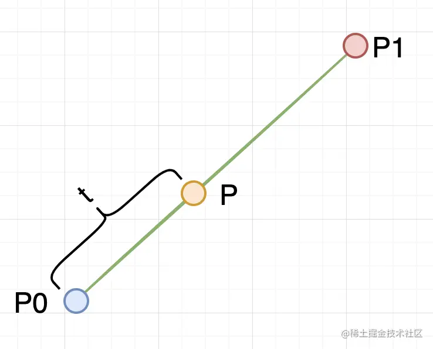
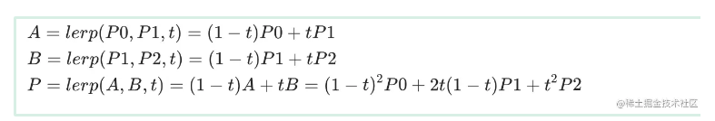

<center><span style="font-size:2rem;font-weight:bold;">贝塞尔曲线详解</span></center>

<div style="page-break-after: always;"></div>

[toc]

<div style="page-break-after: always;"></div>

# 贝塞尔曲线介绍

```markdown
贝塞尔曲线 (Bézier curve) 由法国数学家 Pierre Bézier 于 1962 年提出的一种矢量曲线，广泛应用于工程绘图、动画设计等领域。贝塞尔曲线是一种运动轨迹曲线，由 n 个点在 n 条线段上匀速运动（不同线段上的速度可能不同），同时开始，同时结束，生成的轨迹曲线。
```
以下是3阶贝塞尔曲线的生成动画：

 

 

# 各阶贝塞尔曲线公式

## 一阶贝塞尔曲线

P 点随时间 t 在 P0到 P1两点之间的线段移动，t=0时刻，P 点和 P0重合，t=1时刻 P 点和 P1重合。最终推导得到 P 点的位置和 P0，P1及 t 的关系是一个线性插值函数

 

 

 

## 二次贝塞尔曲线

 二次贝塞尔曲线控制点有3个，如下图所示。


一共有 P0、P1和 P2三个控制点，那P 点的位置怎么来的呢？其实P 点是 A 点到 B 点的一次贝塞尔曲线，而 A 点是 P0到 P1的一次贝塞尔曲线，B 点是 P1到 P2的一次贝塞尔曲线。随着时间 t 的变化，A 点和 B 点的位置会改变，从而使得 P 点会沿着 P0、P1到 P2的一段曲线运动，而更为神气的是这是一条平滑的曲线。下面是数学公式推导和实际的动图演示。

 

![二次贝塞尔曲线演示动画，t in [0,1]](贝塞尔曲线详解.assets/Bézier_2_big.gif) 

## 三次贝塞尔曲线

有了二次贝塞尔曲线的推导过程，实际上三次贝塞尔曲线的推导过程是一样的

 

三次贝塞尔曲线有4个控制点，上图各个点的关系如下：

- A 点是 P0到 P1的一次贝塞尔曲线，B 点是 P1到 P2的一次贝塞尔曲线，C 点是 P2到 P3的一次贝塞尔曲线；
- D 点是 A 点到 B 点的一次贝塞尔曲线（也是 P0，P1和 P2的二次贝塞尔曲线），E 点是 B 点到 C 点的一次贝塞尔曲线（也是 P1，P2到 P3的二次贝塞尔曲线）；
- P 点是 D 点到 E 点的一次贝塞尔曲线，也是 A ,B 和 C 的二次贝塞尔曲线，进而就是 P0，P1，P2和 P3的三次贝塞尔曲线了。

 

![三次贝塞尔曲线演示动画，t in [0,1]](贝塞尔曲线详解.assets/Bézier_3_big.gif) 

##  四次贝塞尔曲线

![四次贝塞尔曲线演示动画，t in [0,1]](贝塞尔曲线详解.assets/Bézier_4_big.gif) 
$$
\begin{align}
A &= lerp(P0,P1,t) = (1-t)P0+tP1 \\
B &= lerp(P1,P2,t) = (1-t)P1+tP2 \\
C &= lerp(P2,P3,t) = (1-t)P2+tP3 \\
D &= lerp(P3,P4,t) = (1-t)P3+tP4 \\
E &= lerp(A,B,t) = (1-t)A+tB \\
  &= (1-t)[(1-t)P0+tP1] + t [(1-t)P1+tP2] \\ 
  &= (1-t)^{2}P0 + 2(1-t)tP1 + t^2 P2  \\
F &= lerp(B,C,t) = (1-t)B+tC \\
  &= (1-t)[(1-t)P1+tP2] + t [(1-t)P2+tP3] \\ 
  &= (1-t)^{2}P1 + 2(1-t)tP2 + t^2P3  \\
G &= lerp(C,D,t) = (1-t)C+tD \\
  &= (1-t)[(1-t)P2+tP3] + t [(1-t)P3+tP4] \\ 
  &= (1-t)^{2}P2 + 2(1-t)tP3 + t^2P4\\
H &= lerp(E,F,t) = (1-t)E+tF \\
  &= (1-t)[(1-t)^{2}P0 + 2(1-t)tP1 + t^2 P2] + t [(1-t)^{2}P1 + 2(1-t)tP2 + t^2P3] \\ 
  &= (1-t)^{3}P0 + 3(1-t)^{2}tP1 + 3(1-t)t^{2}P2 + t^3P3\\
I &= lerp(F,G,t) = (1-t)F+tG \\
  &= (1-t)[(1-t)^{2}P1 + 2(1-t)tP2 + t^2P3] + t [(1-t)^{2}P2 + 2(1-t)tP3 + t^2P4] \\ 
  &= (1-t)^{3}P1 + 3(1-t)^{2}tP2 + 3(1-t)t^{2}P3 + t^3P4\\
P &= lerp(H,I,t) = (1-t)H+tI \\
  &= (1-t)[(1-t)^{3}P0 + 3(1-t)^{2}tP1 + 3(1-t)t^{2}P2 + t^3P3] + t [(1-t)^{3}P1 + 3(1-t)^{2}tP2 + 3(1-t)t^{2}P3 + t^3P4] \\ 
  &= (1-t)^{4}P0 + 4(1-t)^{3}tP1 + 6(1-t)^{2}t^{2}P2 + 4(1-t)t^{3}P1 + t^4P4 \\
\end{align}
$$


## 五次贝塞尔曲线

 
$$
\begin{align}
A &= lerp(P0,P1,t) = (1-t)P0+tP1 \\
B &= lerp(P1,P2,t) = (1-t)P1+tP2 \\
C &= lerp(P2,P3,t) = (1-t)P2+tP3 \\
D &= lerp(P3,P4,t) = (1-t)P3+tP4 \\
E &= lerp(P4,P5,t) = (1-t)P4+tP5 \\

F &= lerp(A,B,t) = (1-t)A+tB \\
  &= (1-t)[(1-t)P0+tP1] + t [(1-t)P1+tP2] \\ 
  &= (1-t)^{2}P0 + 2(1-t)tP1 + t^2 P2  \\
G &= lerp(B,C,t) = (1-t)B+tC \\
  &= (1-t)[(1-t)P1+tP2] + t [(1-t)P2+tP3] \\ 
  &= (1-t)^{2}P1 + 2(1-t)tP2 + t^2P3  \\
H &= lerp(C,D,t) = (1-t)C+tD \\
  &= (1-t)[(1-t)P2+tP3] + t [(1-t)P3+tP4] \\ 
  &= (1-t)^{2}P2 + 2(1-t)tP3 + t^2P4\\
I &= lerp(D,E,t) = (1-t)D+tE \\
  &= (1-t)[(1-t)P3+tP4 ] + t[(1-t)P4+tP5] \\ 
  &= (1-t)^{2}P3 + 2(1-t)tP4 + t^2P5 \\
  
J &= lerp(F,G,t) = (1-t)F+tG \\
  &= (1-t)[(1-t)^{2}P0 + 2(1-t)tP1 + t^2 P2] + t [(1-t)^{2}P1 + 2(1-t)tP2 + t^2P3] \\ 
  &= (1-t)^{3}P0 + 3(1-t)^{2}tP1 + 3(1-t)t^{2}P2 + t^3P3\\
K &= lerp(G,H,t) = (1-t)G+tH \\
  &= (1-t)[(1-t)^{2}P1 + 2(1-t)tP2 + t^2P3] + t [(1-t)^{2}P2 + 2(1-t)tP3 + t^2P4] \\ 
  &= (1-t)^{3}P1 + 3(1-t)^{2}tP2 + 3(1-t)t^{2}P3 + t^3P4\\
L &= lerp(H,I,t) = (1-t)F+tG \\
  &= (1-t)[(1-t)^{2}P2 + 2(1-t)tP3 + t^2P4] + t [(1-t)^{2}P3 + 2(1-t)tP4 + t^2P5] \\ 
  &= (1-t)^{3}P2 + 3(1-t)^{2}tP3 + 3(1-t)t^{2}P4 + t^3P5\\
  
M &= lerp(J,K,t) = (1-t)J+tK \\
  &= (1-t)[(1-t)^{3}P0 + 3(1-t)^{2}tP1 + 3(1-t)t^{2}P2 + t^3P3] + t [(1-t)^{3}P1 + 3(1-t)^{2}tP2 + 3(1-t)t^{2}P3 + t^3P4] \\ 
  &= (1-t)^{4}P0 + 4(1-t)^{3}tP1 + 6(1-t)^{2}t^{2}P2 + 4(1-t)t^{3}P1 + t^4P4 \\
N &= lerp(K,L,t) = (1-t)K+tL \\
  &= (1-t)[(1-t)^{3}P0 + 3(1-t)^{2}tP1 + 3(1-t)t^{2}P2 + t^3P3] + t [(1-t)^{3}P1 + 3(1-t)^{2}tP2 + 3(1-t)t^{2}P3 + t^3P4] \\ 
  &= (1-t)^{4}P1 + 4(1-t)^{3}tP2 + 6(1-t)^{2}t^{2}P3 + 4(1-t)t^{3}P4 + t^4P5 \\
  
P &= lerp(M,N,t) = (1-t)M+tN \\
  &= (1-t)[(1-t)^{4}P0 + 4(1-t)^{3}tP1 + 6(1-t)^{2}t^{2}P2 + 4(1-t)t^{3}P1 + t^4P4] + t[(1-t)^{4}P1 + 4(1-t)^{3}tP2 + 6(1-t)^{2}t^{2}P3 + 4(1-t)t^{3}P4 + t^4P5] \\
  &= (1-t)^{5}P0+5(1-t)^4tP1+10(1-t)^{3}t^2 P2+10(1-t)^2 t^3 P3+5(1-t)t^4 P4+t^5 P5 \\
\end{align}
$$

# 贝塞尔曲线统一公式

 

仔细看可以发现, 贝塞尔的参数B是二项式(t+(1-t))^n = (1)^n的展开公式. 

**划重点了: 系数是二项式的展开**

# 贝塞尔曲线特性

 

# 贝塞尔曲线导数

## 导数一般形式

 

 

 

 

 

 

## 2次贝塞尔的多阶导数

2次贝塞尔曲线公式
$$
\LARGE
\begin{align}
P(t) &= (1-t)^2 P0 + 2t(1-t)P1 + t^2 P2 
\end{align}
$$
一阶导数
$$
\LARGE
\begin{align}
\dot{P}(t) &= 2[(1-t)(P1-P0) + t(P2-P1)] \\
\end{align}
$$
二阶导数
$$
\LARGE
\begin{align}
\ddot{P}(t) &= 2 * 1 [P2-2P1+P0] \\
\end{align}
$$

## 3次贝塞尔曲线的多阶导数

3次贝塞尔曲线公式
$$
\LARGE
\begin{align}
P(t) &= (1-t)^3 P0 + 2(1-t)^2 t P1 + 2(1-t)t^2 P2 + t^3 P3 
\end{align}
$$
一阶导数
$$
\LARGE
\begin{align}
\dot{P}(t) &= 3[(1-t)^2 (P1-P0) + 2t(1-t)(P2-P1) + t^2 (P3-P2)] \\
\end{align}
$$
二阶导数
$$
\LARGE
\begin{align}
\ddot{P}(t) &= 3 [(1-t) (\dot{P}1 -\dot{P}0) + t(\dot{P}2 -\dot{P}1)] \\
            &= 3 * 2 [(1-t)((P2-P1)-(P1-P0)) + t((P3-P2)-(P2-P1))] \\
            &= 3 * 2 [(1-t)(P2-2P1+P0) + t(P3-2P2+P1)]
\end{align}
$$
三阶导数
$$
\LARGE
\begin{align}
\dddot{P}(t) &= 3 * 2  [(\ddot{P}1 -\ddot{P}0)] \\
            &= 3 * 2 * 1 [(P3-2P2+P1) + (P2-2P1+P0)] \\
            &= 3 * 2 * 1 [P3-P2-P1+P0]
\end{align}
$$

## 4次贝塞尔曲线的多阶导数

4次贝塞尔曲线公式
$$
\LARGE
\begin{align}
P(t) = (1-t)^{4}P0 + 4(1-t)^{3}tP1 + 6(1-t)^{2}t^{2}P2 + 4(1-t)t^{3}P1 + t^4P4
\end{align}
$$
一阶导数
$$
\begin{align}
\dot{P}(t) &= 4[(1-t)^3 (P1-P0) + 2(1-t)^2 t (P2-P1) + 2(1-t)t^2 (P3-P2) + t^3 (P4-P3)]  \\
\end{align}
$$
二阶导数
$$
\begin{align}
\ddot{P}(t) &= 4 [(1-t)^2 (\dot{P}1 - \dot{P}0) + 2t(1-t)(\dot{P}2 - \dot{P}1)+ t^2 (\dot{P}3 -\dot{P}2) ] \\
            &= 4 * 3 [(1-t)^2 (P2-2P1+P0) + 2t(1-t)(P3-2P2+P1) + t^2 (P4-2P3+P2)] \\
\end{align}
$$
三阶导数
$$
\begin{align}
\dddot{P}(t) &= 4 * 3 [(1-t) (\ddot{P} 1 - \ddot{P} 0) +  t (\ddot{P} 2 - \ddot{P} 1)]  \\
             &= 4 * 3 * 2[(1-t)(P3-3P2+3P1-P0) + t(P4-3P3+3P2-P1)]
\end{align}
$$

## 5次贝塞尔曲线的多阶导数

5次贝塞尔曲线公式
$$
\begin{align}
P(t) = (1-t)^{5}P0+5(1-t)^4tP1+10(1-t)^{3}t^2 P2+10(1-t)^2 t^3 P3+5(1-t)t^4 P4+t^5 P5
\end{align}
$$
一阶导数
$$
\begin{align}
\dot{P}(t) = 5 * [(1-t)^{4}(P1-P0) + 4(1-t)^{3}t(P2-P1) + 6(1-t)^{2}t^{2}(P3-P2) + 4(1-t)t^{3}(P4-P3) + t^4(P5-P4)]
\end{align}
$$
二阶导数
$$
\begin{align}
\ddot{P}(t) &=  5 *[(1-t)^3 (\dot{P}1 -\dot{P}0)  + 2(1-t)^2 t (\dot{P}2 -\dot{P}1) + 2(1-t)t^2 (\dot{P}3 -\dot{P}2) + t^3 (\dot{P}4 -\dot{P}3)] \\
            &= 5 * 4[(1-t)^3 (P2-2P1+P0)  + 2(1-t)^2 t (P3-2P2+P1) + 2(1-t)t^2 (P4-2P3+P2) + t^3 (P5-2P4+P3)] \\
\end{align}
$$
三阶导数
$$
\begin{align}
\dddot{P}(t) &= 5 * 4*[(1-t)^2 (\ddot{P1} - \ddot{P0}) + 2t(1-t)(\ddot{P2} - \ddot{P1}) + t^2 (\ddot{P3} - \ddot{P2})]  \\
             &= 5 * 4 * 3 [(1-t)^2 (P3-3P2+3P1-P0) + 2t(1-t)(P4-3P3+3P2-P1) + t^2 (P5-3P4+3P3-P2)] \\
\end{align}
$$
