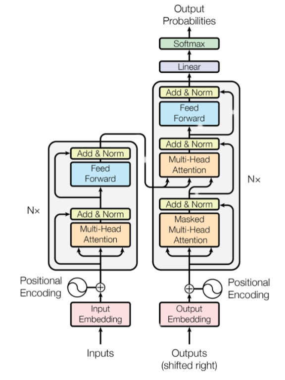

Transformer和注意力机制详解

Transformer结构来源于谷歌2017年的论文[《Attention is All You Need》](https://arxiv.org/abs/1706.03762).

Transformer的网络架构由且仅由self-Attenion和Feed Forward Neural Network组成，没有用到传统的CNN或者RNN，一个基于Transformer的可训练的神经网络可以通过堆叠Transformer的形式进行搭建。正因如此，Transformer成为继CNN和RNN之后又一个**高效的特征提取器**。

 

# 注意力机制

Attention的思路，简单用四个字“带权求和”就可以高度概括，或者说**在不同的上下文语境中，关注到不同的信息**。Attention的思想最早于2015年的ICLR《Neural machine translation by jointly learning to align and translate》提出，后来在NLP、CV遍地开花。Attention 赋予模型区分辨别能力，从纷繁的信息中找到应当focus的重点。 