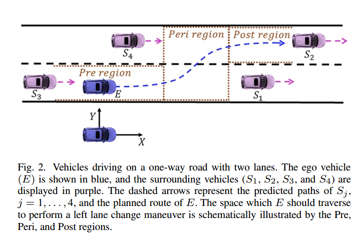

Lane Change Maneuvers for Automated Vehicles论文研读

[toc]

# 综述

这篇论文的中心思想就是将在高速拥堵路段的换道表示为无碰撞的纵向轨迹的规划，**这篇论文将换道分为三个阶段，调整阶段($$T_{pre} $$)，横向运动阶段($$T_{prei} $$)，进入目标车道阶段($$T_{post}$$​)**。这三个阶段都表示纵向的轨迹规划阶段，论文认为只要在这个三个阶段中纵向轨迹安全(在调整阶段会考虑目标车道障碍物)，则横向移动也是无碰撞的。

 

论文主要的步骤如下：

 

其中步骤一，在本篇论文中也可以使用步骤二和三多次迭代的结果替代，但是加上步骤一(实际上就是一个预处理步骤，目的是找到一个比较合适的空隙以及开始横向移动的时间，通俗一点理解就是找到一个能插进去的缝和开始插的时间)，能够大幅缩短计算的耗时。

# STEP 1 inter-vehicle traffic gap and time instance

但是本论文中并没有体积步骤一的搜索方式，因此需要自己调研设计

本论文中提及的gap以及time搜索实际在章节二的A3部分，只是提了一下，核心内容如下

论文将变道的可执行轨迹分为三部分：

式中，$T$表示的对应轨迹，N表示时间段，为了变道过程舒适，gap的筛选逻辑为选择第一个阶段内加速度绝对值最小的点作为对应的gap，以及每个time-instance 

- [ ] 需要做的事：补齐gap以及time instance 的设计方式

 

# STEP 2 longitude trajectory corridor generate

论文中纵向的安全走廊生成比较简单，就是一个S-T图就可以完全表示

还是核心的三个阶段(以图一为例)

 

## pre阶段

pre阶段即调整阶段，就是将自车EGO的位置通过加速或者减速到达指定开始横向移动的gap之前的阶段。这时候因为EGO还在本车道，因此这个阶段的纵向走廊只需要考虑$S_1$和$S_2$车就可以了，因此这个阶段的纵向位置约束为：

 

## peri阶段 

peri阶段就是开始横向移动到目标车道的阶段，此时自车的运动轨迹涉及到了本车道以及目标车道，因此此时需要将周围4辆车都考虑进来，因此这个阶段的纵向走廊位置约束为：

 

## post阶段

post阶段就是在目标车道的调整阶段，从不居中调整到居中阶段，此时自车已经处于目标车道了，因此不需要考虑原车道的障碍物，此时只需要考虑目标车道的前后两个障碍物($S_2$和$S_4$)即可，因此本阶段的纵向位置走廊约束为：

 

## 注意：

上式中的一些值的物理意义如下：

式中的$x$表示的是纵向距离，$s_j$表示的是周围的车辆,$s_m$表示的是对应障碍物的安全距离，$N_{peri}$ ，$N_{post}$，$N$表示的是3个阶段的时间，其中$N_{peri}$的是开始横向移动的时间，即论文中的$time-instance$，$N_{post}$表示的是进入了目标车道的时间，从这个时间起就已经进入到了目标车道，此时回到原车道。

其中$N_{post}$计算方式为：

 

式中的$n_{min}$为以期望的横线加速度自车从原车道行驶到目标车道所需要的时间

其中针对每辆车的安全距离计算$s_{m}$方式为：

 

式中$\epsilon_{jk}$表示的是跟随这个障碍物的最短距离，$\tau_{S_{jk}}$表示的最短时距，$v_{S_{jk}}$表示的是这个障碍物的速度

# SETP 3 longitude trajectory 生成

本论文中的纵向轨迹生成，使用的是标准的QP优化问题，自变量就是N个control_input：$a_x$，对应的cost-function如下所示：

 

式中$\vartheta_{k} $，$\kappa_{k}$，$\varrho_{k}$表示的是三项的标量权重系数，其中包含三项分别是与期望速度的差值，加速度的惩罚项，jerk的惩罚项

式中$v,a,\Delta a$的计算公式如下：

 

 

该QP问题的约束项如下：

 

综上所述，求解该QP问题即可得到纵向加速度，之后根据4式的积分公式，可以得到对应的速度以及位置

## 注意：

论文还考虑了一种情况，就是道路上的每辆车都可能存在急刹车的情况，因此在变道的时候需要把这个情况考虑进来，如何考虑进来呢，论文提出一种使用安全时距以及最大减速度计算这个阶段最大的速度，这样即便前车以自车的最大减速度刹车，自车也能保持免碰撞(论文假设道路上每辆车的最大减速度一致)

计算方式如下：

 

 