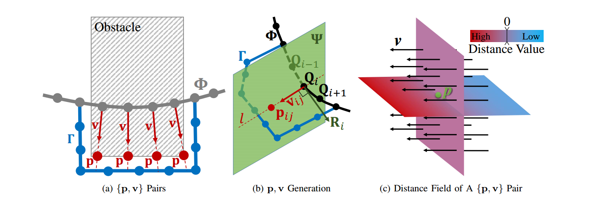
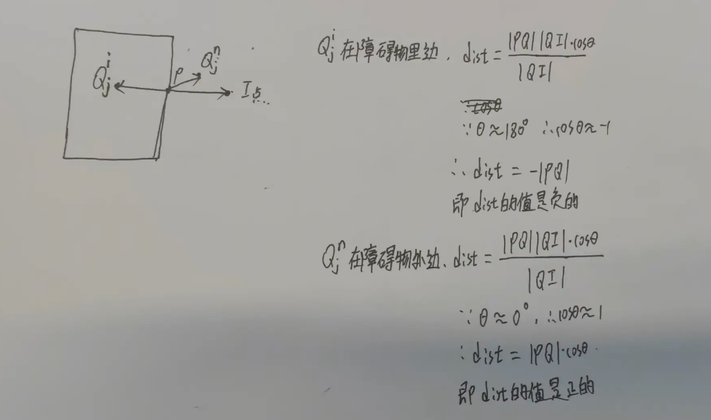
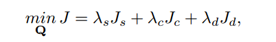
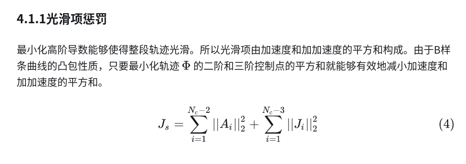
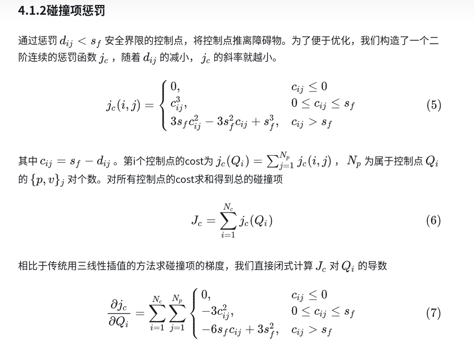
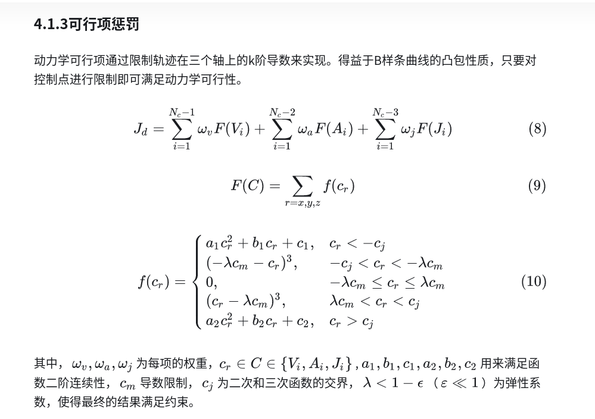
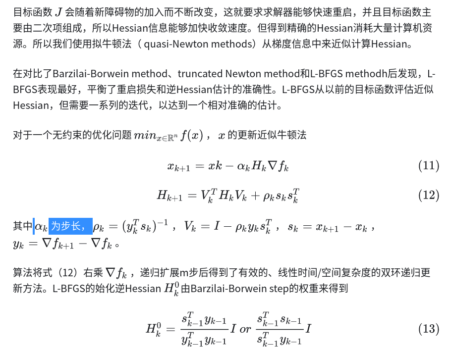
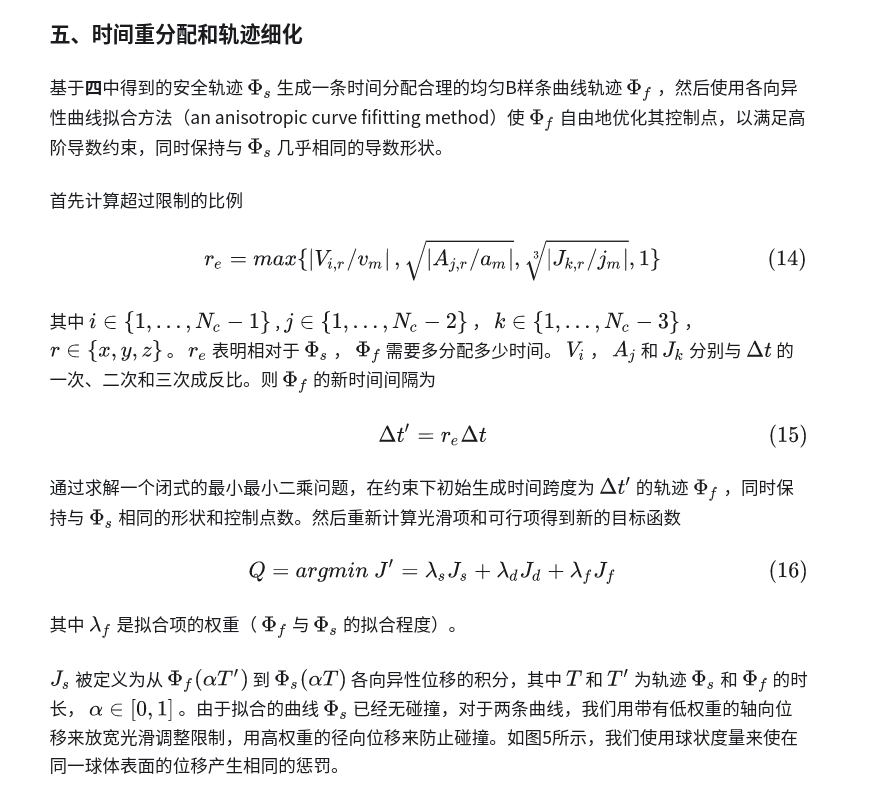
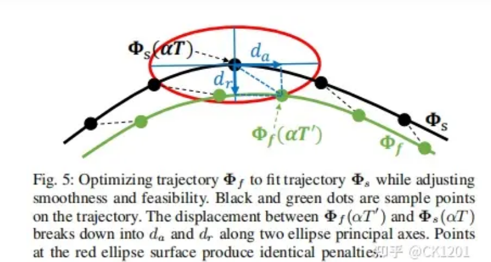
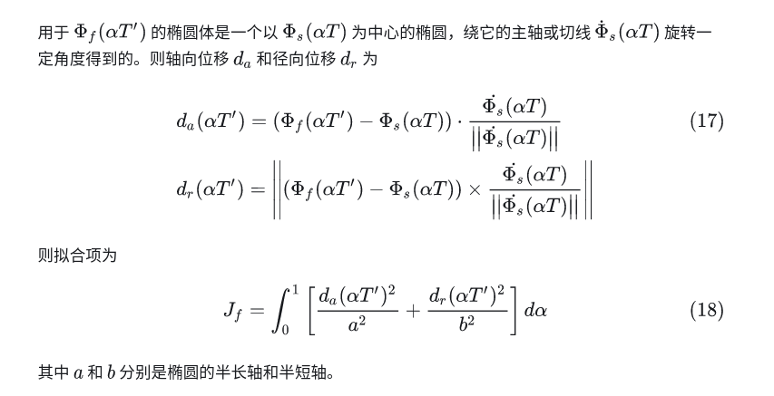

ego-planner解析

[toc]

# 绪论

ego-planner是浙大实验室提出的一种无人机在复杂环境中自出飞行的轨迹规划算法，主要的核心思想就是利用B样条的凸包性质，去掉非常耗费计算资源的ESDF地图构建，使用一种新型的障碍物距离表示方法，对轨迹的安全约束进行二次优化，大幅提高计算效率。核心思想就是下面这张图

 

# 算法流程

流程框图

首先给定起点与终点坐标，然后根据起始点终止点的约束信息(p,v,a)生成一条满足约束的初始B样条曲线(不考虑是否碰撞)，然后开始对这些点就行迭代优化。迭代优化过程如下：

## 求解(p,v)对

首先遍历第一步得到的控制点，然后根据地图分辨率设置比例，根据比例精细计算对应的每个控制点是否处于占据栅格内部(根据障碍物坐标以及框体大小将对应的栅格坐标设置为占据)，根据是否占据找出每一段与障碍物相交的控制点序列，也可称作初始碰撞轨迹段(由初始节点以及终止节点组成)。

得到所有的初始碰撞轨迹段之后，采用A*搜索算法，以每个初始碰撞轨迹段的初始节点为起点，终止节点为终点，搜索一条最短的无碰撞路径

然后开始求解每个初始碰撞轨迹控制节点Q对应的(p,v)对，求解方法如下：

首先遍历初始碰撞轨迹段的每个控制节点，然后从对应的A*无碰撞路径中寻找距离碰撞控制节点最近的点，设定位intersection节点，然后连接intersection节点与对应的Q节点，在连线上按比例找点，寻找与障碍物表面上的点(通过判断连线上的点是否在占据栅格内部)，如果上一个在下一个不在，说明这个点就在表面附近，根据比例在Q节点和intersection节点连线上插值计算障碍物避免点p，之后连接Q和intersection节点，除以他们的模，得到对应v；此时每个Q节点对应的(p,v)对计算完成

注意：如果一个Q节点处于多个障碍物之间，那么这个Q将会对应多个(p,v)对，障碍物的探测是通过迭代控制点发现的。

## 设计距离函数

论文中设计的距离公式如下所示：

  

物理意义表示的是控制点Q和障碍物表面上点p的横向距离

计算方式如图：

 

## 迭代与优化

迭代的意思是每次对当前的控制点进行二次优化，计算cost,然后通过判断优化后的控制点寻找新的障碍物，直到cost最小或者没有发生碰撞

### 二次优化

#### 目标函数

 

分为光滑性代价，碰撞代价，以及动力学可行性代价

 

 

 

### 基于梯度的数值优化

论文使用的是带梯度L-BFGS优化算法

 

## 时间重新分配

 

 

 

参考文献

[知乎解析](https://zhuanlan.zhihu.com/p/366372048)

[论文](https://ieeexplore.ieee.org/stamp/stamp.jsp?tp=&arnumber=9309347)