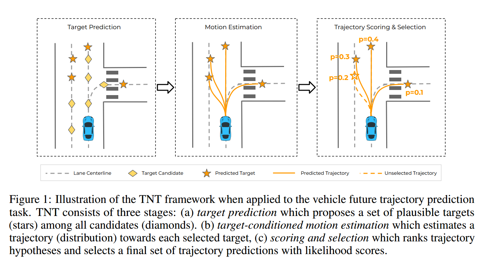

<center><span style="font-size:2rem;font-weight:bold;">TNT论文阅读理解</span></center>

[toc]

<div style="page-break-after: always;"></div>

# 论文简介

TNT全称是TNT:Target-driveN Trajectory Prediction，顾名思义基于目标点的轨迹预测。

论文主要的思想点将agents轨迹预测的不确定性转化为两种不确定性，第一种是目标的不确定性(**the target or intent uncertainty**)，第二种是控制的不确定性(**the control uncertainty**)。

目标的不确定性，指的是，在结构化道路中，每个agents的均存在一个运动目标，即他们的运动都是有序的，但是运动的目标不确定，什么意思呢？
例如在一个路口中有三条车道，左转，直行，右转，那么一个具体的车辆在这个路口中行驶，它有可能左转，右转或者直行，即便我们确定它要左转，但是他在什么地点左转也存在不确定性。

控制的不确定性：指的是，在道路上行驶时，即便已知车辆的行驶目标是左转，且知道它要在什么地点行驶到左转车道，但是该车辆从当前位置行驶到目标位置的轨迹并不确定，即它可以直接压线开过去，或者他可以很早就变道过去，或者它直行一段时间再过去，即可能存在多个到达目标点的轨迹。这就是控制的不确定性。

论文将轨迹预测的不确定性转换为这两种不确定性之后，论文提出了三步的轨迹预测方法:

1. 首先对agents的目标位置进行预测，得到一系列的target-points，对这些target-points与真值数据学习，计算每个target的概率；

2. 然后将每个target作为第二层的输入，输出到达这个target可能的轨迹，对这些轨迹进行训练，最后计算每条轨迹的概率；
3. 最后对每条轨迹打分，选择最可能的轨迹作为agents的预测轨迹

 

# 详解

## Formulation

论文设置每个agent的观测量为$ S_{p} = [S_{-T^{'}+1},S_{-T^{'}+2},...,S_{0}]$，论文的目标是预测该agent的未来状态$S_{F} = [S_{1},S_{2},...,S_{T}]$，时间$T$是固定的，且将hdmap包含的道路信息或者其他agent的信息用$ c_{p} = [c_{-T^{'}+1},c_{-T^{'}+2},...,c_{0}]$。因此将输入量定义为：$x = (s_{p},c_{p})$，最终的概率输出表达式就是$p(s_{F}|x)$

由于论文将轨迹预测的不确定性转换为目标不确定性以及控制不确定性，因此最终的预测轨迹概率问题可以由以下公式计算：
$$
\LARGE
p(s_{F}|x) = \int\limits_{\tau \in \Gamma(c_{p})}^{} p(\tau|x)p(s_{F}|x)d\tau
$$
式中$Gamma(c_{p})$表示空间中采集的目标点

## 场景编码

针对存在hdmap的场景编码，论文中采用的是vectorNet的方式，这里不在赘述，具体看另一篇VectorNet的详解。

主要的思想就是将hdmap以及agents的一些特征以vetcor的形式构建，每个单独的agent都存在多个互联vector，然后使用MLP将这些vector相连，生成全局的graph，将每个agent的graph相连，形成图网络。

## 目标预测

在这个模块的论文目标是在固定的时刻T，采样多个不同的目标点，然后训练学习得到这些目标点的概率分布。

设定目标点的方式是在真实目标点周围按照正态分布的方式，随机选择多个target，每个target对应的都是(x,y)坐标。目标点获得方式可由一下方式得到：
$$
\LARGE
p(\tau ^ {n}|x) = \pi (\tau ^ {n}|x) \cdot N(\bigtriangleup x^{n}| v^{n}(x)) \cdot N(\bigtriangleup y^{n}| v^{n}(y))
$$


式中$\pi (\tau ^ {n}|x) = expf(\tau ^{n},x) /  {\textstyle \sum_{\tau ^{'}}^{}f(\tau^{'},x)} $表示的是基于目标位置的离散分布，$N$表示正态分布，$v$表示均值，方差为单位方差

上式中的函数$f$和均值$v$均为可训练的量，论文中使用的是双层的MLP，输入量是目标点位置$(x^{k},y^{k})$与地图信息$x$,用来预测目标位置以及其最可能的偏移量离散分布。

损失函数定义如下：
$$
\LARGE
L_{S1} = L_{cls}(\pi , u) + L_{offset}(v_{x},v_{y},\triangle x,\triangle y)
$$
式中的$L_{cls}$表示的是交叉熵损失函数，$L_{offset}$使用Huber损失函数，$u$是距离真值最近的目标点，$\triangle x,\triangle y$​表示的是目标点与真值空间偏移量

### 交叉熵损失函数(cross entropy)

交叉熵（Cross Entropy）是一种用于评估分类模型性能的损失函数，它衡量了预测分布与实际分布之间的差异。在机器学习和深度学习中，交叉熵损失通常用于分类任务，如二分类和多分类问题。

### 交叉熵的定义

交叉熵损失函数定义为：

#### 对于二分类问题：
对于二分类问题，交叉熵损失的公式为：

\[ \text{Loss} = -\frac{1}{N} \sum_{i=1}^{N} \left( y_i \log(p_i) + (1 - y_i) \log(1 - p_i) \right) \]

其中：
- \( N \) 是样本数量。
- \( y_i \) 是第 \( i \) 个样本的实际标签，取值为0或1。
- \( p_i \) 是模型对第 \( i \) 个样本的预测概率，表示样本属于类别1的概率。

#### 对于多分类问题：
对于多分类问题，交叉熵损失的公式为：

\[ \text{Loss} = -\frac{1}{N} \sum_{i=1}^{N} \sum_{j=1}^{C} y_{ij} \log(p_{ij}) \]

其中：
- \( N \) 是样本数量。
- \( C \) 是类别数量。
- \( y_{ij} \) 是第 \( i \) 个样本在第 \( j \) 类的实际标签，通常是一个独热编码（one-hot encoding）。
- \( p_{ij} \) 是模型对第 \( i \) 个样本属于第 \( j \) 类的预测概率。

### 交叉熵的意义

交叉熵用于衡量两个概率分布之间的相似性。对于分类问题，交叉熵衡量的是模型预测的概率分布与实际标签分布之间的差异。交叉熵损失越小，模型的预测越准确。

### 交叉熵在神经网络中的应用

在神经网络中，交叉熵损失通常与 Softmax 激活函数结合使用，以处理多分类问题。Softmax 函数将网络的输出转换为概率分布，使其适用于交叉熵损失。

### 示例代码

#### 使用 Python 和 TensorFlow

以下是使用 TensorFlow 计算交叉熵损失的示例：

```python
import tensorflow as tf

# 假设我们有以下标签和预测
labels = [[0, 1], [1, 0], [0, 0, 1]]
logits = [[2.0, 1.0], [1.0, 2.0], [1.0, 2.0, 3.0]]

# 使用 TensorFlow 计算交叉熵损失
loss = tf.nn.softmax_cross_entropy_with_logits(labels=labels, logits=logits)
mean_loss = tf.reduce_mean(loss)

print('Cross Entropy Loss:', mean_loss.numpy())
```

#### 使用 Python 和 PyTorch

以下是使用 PyTorch 计算交叉熵损失的示例：

```python
import torch
import torch.nn as nn

# 假设我们有以下标签和预测
labels = torch.tensor([1, 0, 2])
logits = torch.tensor([[2.0, 1.0], [1.0, 2.0], [1.0, 2.0, 3.0]])

# 使用 PyTorch 计算交叉熵损失
loss_fn = nn.CrossEntropyLoss()
loss = loss_fn(logits, labels)

print('Cross Entropy Loss:', loss.item())
```

### 总结

交叉熵是一种重要的损失函数，广泛应用于分类任务中。它衡量模型预测的概率分布与实际标签分布之间的差异，通过最小化交叉熵损失，可以训练出更加准确的分类模型。

## 预测轨迹生成

在这个模块，对上一步生成的target建模轨迹的概率的正态分布。该模块也是由2层的MLP组成的。

该模块的输入是上一步的target $\tau$以及地图特征$x$,并且输出是针对每个目标点的最可能的一条轨迹。在这个步骤里边为了加快训练速度以及正确率，采用的是教师模型强制(teacher forcing technique)，定义的损失函数如下所示：
$$
\LARGE
L_{S2} = \sum_{t=1}^{T}L_{reg}(\hat{s_{t}},s_t) 
$$
式中$L_{reg}$表示的是每一时间点都使用的是Huber损失函数，$\hat{s_{t}}$表示的是时间点t时刻的预测坐标，$s_{t}$表示的是真值坐标

### 教师强制模型(teacher forcing technique)

教师强制（Teacher Forcing）是一种用于训练递归神经网络（RNN）和序列模型的技术，尤其常用于序列到序列（Seq2Seq）模型，如机器翻译和文本生成任务中。

### 教师强制的概念

在训练过程中，教师强制技术使用真实的目标序列作为模型的输入，而不是使用模型在前一步生成的预测结果。这种方法加速了训练并帮助模型更快地收敛。

### 工作原理

在标准的序列生成任务中，模型在每个时间步生成一个输出，然后将该输出作为下一个时间步的输入。这种方法的问题在于，如果模型生成了错误的输出，错误会逐步累积并影响后续的预测。

教师强制的解决方法如下：

1. **真实目标输入**：在每个时间步，模型不仅依赖前一步生成的输出，还使用实际的目标序列作为输入。
2. **加速收敛**：通过提供正确的输入，模型能够更快地学习到正确的序列生成规则。

### 示例

假设我们有一个简单的序列生成任务，其中输入序列是 `x = [x1, x2, x3]`，目标输出序列是 `y = [y1, y2, y3]`。在没有教师强制的情况下，模型的生成过程如下：

```
输入: x1 -> 生成 y1'
输入: y1' -> 生成 y2'
输入: y2' -> 生成 y3'
```

使用教师强制的情况下，过程如下：

```
输入: x1 -> 生成 y1'
输入: y1 -> 生成 y2'
输入: y2 -> 生成 y3'
```

可以看出，在每一步模型都使用真实的目标 `y1` 和 `y2` 作为输入，而不是模型自己的预测 `y1'` 和 `y2'`。

### 示例代码

以下是使用 PyTorch 实现教师强制技术的示例：

```python
import torch
import torch.nn as nn
import torch.optim as optim

class Seq2SeqModel(nn.Module):
    def __init__(self, input_dim, hidden_dim, output_dim):
        super(Seq2SeqModel, self).__init__()
        self.encoder = nn.LSTM(input_dim, hidden_dim)
        self.decoder = nn.LSTM(hidden_dim, hidden_dim)
        self.fc = nn.Linear(hidden_dim, output_dim)

    def forward(self, src, trg, teacher_forcing_ratio=0.5):
        encoder_outputs, (hidden, cell) = self.encoder(src)
        outputs = []
        input = trg[0, :]
        for t in range(1, trg.size(0)):
            output, (hidden, cell) = self.decoder(input.unsqueeze(0), (hidden, cell))
            prediction = self.fc(output.squeeze(0))
            outputs.append(prediction)
            teacher_force = torch.rand(1).item() < teacher_forcing_ratio
            input = trg[t] if teacher_force else prediction
        return torch.stack(outputs)

# 参数设置
input_dim = 10
hidden_dim = 20
output_dim = 10

# 创建模型
model = Seq2SeqModel(input_dim, hidden_dim, output_dim)

# 示例数据
src = torch.randn(5, 3, input_dim)  # (sequence_length, batch_size, input_dim)
trg = torch.randn(5, 3, output_dim)  # (sequence_length, batch_size, output_dim)

# 前向传播
output = model(src, trg, teacher_forcing_ratio=0.7)
print(output)
```

### 优缺点

**优点**：
- **加速训练**：教师强制技术帮助模型更快地学习正确的序列生成规则。
- **减少错误累积**：通过使用真实的目标序列作为输入，减少了模型错误逐步累积的可能性。

**缺点**：
- **训练和推理不一致**：在训练过程中使用真实目标作为输入，但在推理过程中只能使用模型自己的预测结果，可能导致性能下降。
- **依赖真实数据**：需要真实的目标序列，这在某些任务中可能不是总是可行的。

### 总结

教师强制是一种有效的训练技术，特别适用于序列生成任务，如机器翻译和文本生成。通过使用真实的目标序列作为输入，教师强制技术帮助模型更快地学习并减少错误累积。然而，这种方法在训练和推理过程中存在不一致性，需要在实际应用中加以平衡。

## 轨迹打分和选择

论文最终的目标是评估未来轨迹的可能性即概率。

论文使用最大熵模型对最终的$M$条轨迹进行打分，公式如下：
$$
\LARGE
\phi (s_{F}|x) = \frac{exp(g(s_{F}|x))}{ {\textstyle \sum_{m=1}^{M} g(s_{F}^{m},x)} }
$$
式中$g(\cdot)$是一个2层的MLP。损失函数使用预测分数和真值分数之间的交叉熵(cross entropy)
$$
\LARGE
L_{S3} = L_{CE}(\phi(s_{F}|x),\varphi(s_{F}))
$$
定义每条预测轨迹的真值得分计算方式为和真值轨迹的距离
$$
\LARGE
\psi (s_{F}) = exp(-D(s,s_{GT})\alpha ) / \sum\nolimits_{s^{'}}^{}exp(-D(s^{'},s_{GT})/\alpha )) 
$$
式中$D(\cdot)$是米级单位，$\alpha$是系数
$$
\LARGE
D(s^{i},s^{j}) = max(|| s_{1}^i - s_{1}^j||_{2}^{2}, ... ,|| s_{t}^i - s_{t}^j||_{2}^{2})
$$
