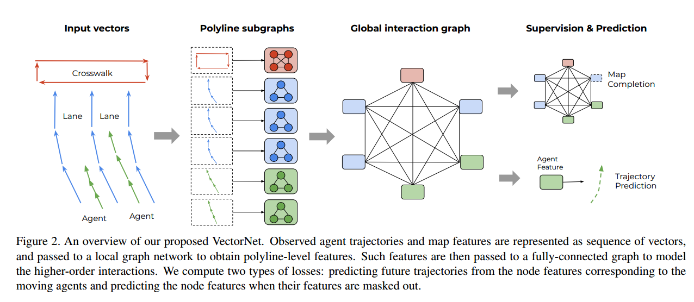
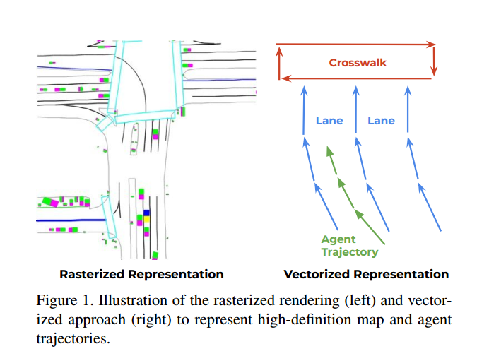
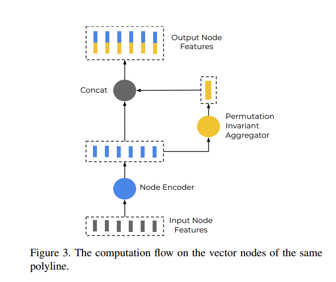

VectorNet论文阅读

[toc]

# #论文介绍

## 论文核心内容

该论文的核心内容是将hdmap中的地图表示以及agents的轨迹表示为一个个相连的向量(vector)，然后将这些vector使用MLP的方式以及集合成global graph的形式，最后调用基于self_attention的GNN网络训练输出多层的全局特征，然后使用MLP的方式将其解码为特征vector，最后将vector再次转换为轨迹的形式。

 

## 详解

### Vector映射

VectorNet将数据主要分为两种，一种是地图数据，一种是agent数据，两种的特征表达方式不太一样

针对地图元素，选择地图元素构成的几何形状，按照空间距离均匀采样key-points，形成vector。

针对agents的轨迹，离散时间向量t，采样控制点，形成vector

主要的形式如下所示：
$$
V_{i} = [d_{i}^{s} ,d_{i}^{e} , a_{i} , j ]
$$
式中的$ d_{i}^{s}$表示该vector的起始点坐标，同样$d_{i}^{e}$表示该vector的终止点坐标，$a_{i}$表示的是该vector的特征(向量类型，轨迹时间戳，道路限速等信息)，$j$表示的是对应的第$j$条曲线

 

### polyline子图构建

为了充分利用每个子图的空间和语义信息，本论文构建的polyline的每个节点都和每一个节点相连，即全联通图

假设一个polyline$P$对应一共有p个节点(vector)， ${v_{1},v_{2},...,v_{p}}$，该论文定义单层的子图传播模型如下：
$$
\LARGE
v_{i}^{l+1} = \varphi_{rel}(g_{enc}(v_{i}^{l}),\varphi_{agg}(\left \{g_{enc}(v_{j}^{l})\right \} ))
$$

式中$v_{i}^{l}$表示第$l$层的节点特征，$v_{i}^{0}$表示的是该节点特征的输入，函数$g_{enc}(.)$表示单一节点的特征传递，函数$\varphi_{agg}(.)$表示集成所有邻居节点的信息，函数$\varphi_{rel}(.)$表示节点$v_{i}$和其邻居节点的相关性函数。

论文中实际实现时，函数$g_{enc}(.)$函数使用的是MLP(权重共享)，这个MLP主要包含三层，初始输入层->层归一化->ReLU(非线性变化激活函数)层。对polyline的各个节点进行encode编码，然后将其邻居节点的编码后的特征节点进行一次最大池化(max pooling)操作,之后采用简单链接(simple concatenation)的方式将本节点编码后的特征向量和其他邻居节点进行链接，然后形成总的全局节点$P$​。流程如下所示：
$$
\LARGE
P = \varphi_{agg}(\left \{ v_{i}^{L_{p}}\right \})
$$
式中的$\varphi_{agg}$是一次最大池化操作。

 

### 全局图构建

在上一步中，论文得到了每条折线对应的全局特征向量$P = \left \{ p_{1} , p_{2} , ...,p_{p}\right \}$，定义的全局节点传递模型为
$$
\LARGE
\left \{ p_{i}^{l+1}\right \} = GNN(\left \{ p_{i}^{l}\right\},A)
$$
论文中假设邻接矩阵$A$是全联通矩阵

论文中使用的图网络模型为自注意力机制，即：
$$
\LARGE
GNN(P) = softmax(P_{Q}P_{K}^{T})P_{V}
$$
最后论文使用MLP对全局特征解码(decoder),反向求解出预测的节点向量，然后生成预测轨迹
$$
\LARGE
v_{i}^{future} = \varphi_{traj}(p_{i}^{L_{t}})
$$
式中$L_{t}$表示的是GNN模型的总层数，$\varphi_{traj}(.)$​表示的是轨迹解码函数

### 辅助graph completion tash

在训练期间，论文随机遮挡一些斜线节点的特征集合，然后通过MLP的方式降级特征解码
$$
\LARGE
\widehat{p}_{i} = \varphi_{node}(p_{i}^{L_{t}})
$$
然后根据起始坐标点寻找对应的特征，将其作为输入
$$
\LARGE
p_{i}^{0} = [p_{i};p_{i}^{id}]
$$

### 训练

经过以

上步骤，论文提出的全局图网络已经构建完毕，此时需要优化训练目标，论文设置的训练目标如下：
$$
\LARGE
L = L_{traj} + \alpha L_{node}
$$
式中的$L_{traj}$使用的是负高斯对数似然损失函数，$L_{node}$表示的是Huber损失函数